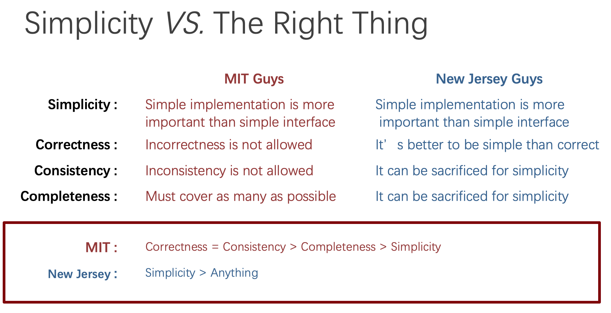
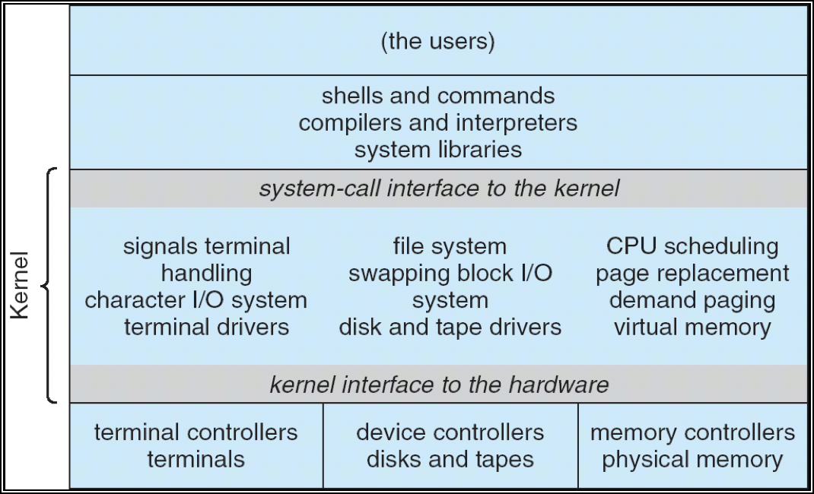
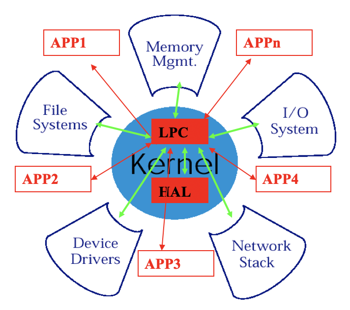
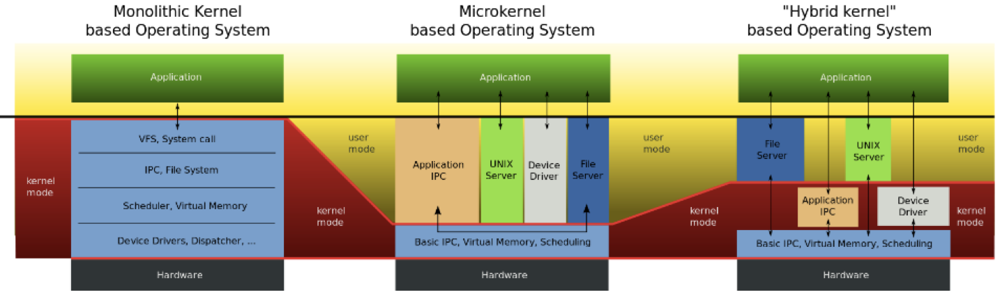
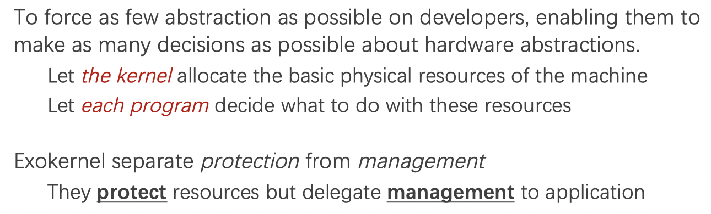
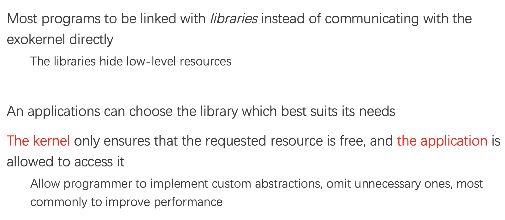
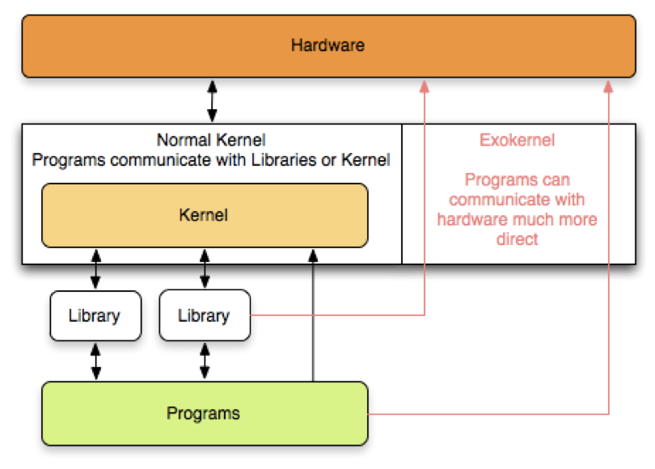
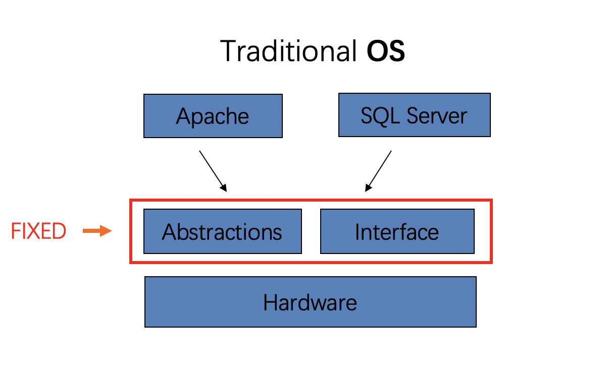
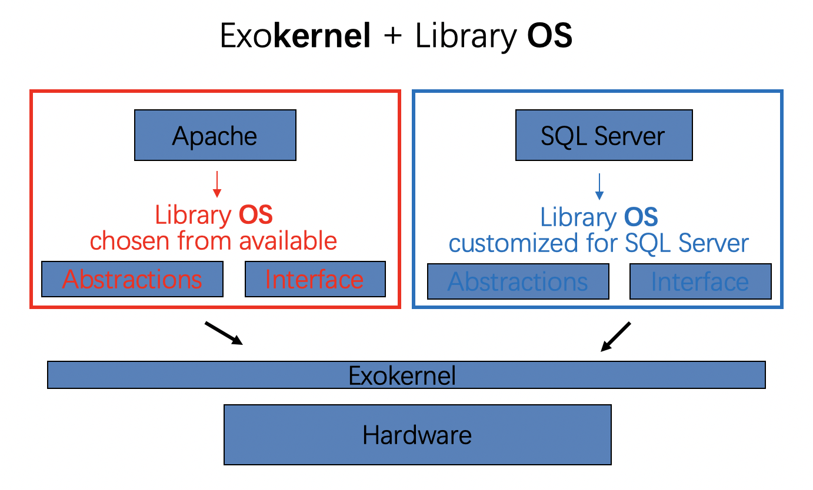

# 1. Complexity VS. Simplicity

## System: What & Why

1. What does system mean?
   - Way to use hardware
     - Knowledge of OS, hardware, compiler, runtime, etc.
     - Eg, page table, TLB, file system
   - Way to think systematically
     - A way of analyzing and solving problems
     - Eg: system design principles
2. Why system?
   - For fun (finding problems)
     - [Time attacks and usernames](https://www.brendanlong.com/timing-attacks-and-usernames.html)
   - For problem (to solve problems)
     - New features
     - Performance
     - Security

## The Principles

1. Principle Group 1
   - Adopt sweeping simplifications
   - Avoid excessive generality
   - Avoid rarely used components
   - Be explicit
   - Decouple modules with indirection
   - Design for iteration
2. Principle Group 2
   - End-to-end argument
   - Escalating complexity principle
   - Incommensurate scaling rule
   - Keep digging principle
   - Law of diminishing returns
   - Open design principle
3. Principle Group 3
   - Principle of least astonishment
   - Robustness Principle
   - Safety margin principle
   - Unyielding foundations rule

## Worse is better

1. [Wiki](https://en.wikipedia.org/wiki/Worse_is_better) 
   - New Jersey: Simplicity > Anything
   - MIT: Correctness = Consistency  > Completeness > Simplicity
2. [Worse is Better](http://dreamsongs.com/WorseIsBetter.html)
   

## Map-Reduce

MapReduce: Simplified Data Processing on Large Clusters, OSDI’ 04

### What map-reduce provides?

- Automatic parallelization and distribution
- Fault-tolerance
- I/O Scheduling
- Status and monitoring
- A simple interface `map()` and `reduce()`

### Programming model

- Map (in_key, in_valuie) -> list(out_key, intermediate_value)
  - Process input key/value pair
  - Produce sets of intermediate pairs
- Reduce (out_key, list(intermediate_value)) -> list(out_value)
  - Combine all intermediate value for a particular key
  - Produce a set of mapped output values (usually just one)

Inspired by similar primitives in `Lisp`

Focus on problem, let **library** deal with messy details. 

### Principles in MapReduce

- Principle of least astonishment
  - The user only need to define map/reduce functions
- Optimize for the common case
  - List the Common scenarios, not all of them
- Robustness principle

### After MapReduce

1. Hadoop
   - An open source implementation of MapReduce
2. Google
   - Pregel for graphic computing
   - Spanner 
   - Dataflow (MapReduce is retired in Google)

### MapReduce: A major step backwards

But for database community

- A giant step backward in the programming paradigm for large scale data-intensive applications
- A sub-optimal implementation, in that it uses brute force instead of indexing
- Not novel at all (similar ideas 25 years ago)
- Missing most of features included in current DBMS
- Incompatible with all of the tools DBMS users have come to depend on

### Another Principle

Design for iteration

- It’s hard to do things right at 1st time

## Shell-Shock: (Bash Attack)

Why shell-shock ever exists?

It is because the principle of UNIX programming

- Write programs that do one thing and do it well
- Write programs that work together
- Write programs that handle *text streams* , because that is a universal interface

## How to make kernel simpler?

1. Monolithic kernel

   - An operating system architecture where the entire operating system is working in kernel space and is alone in supervisor mode
   - The monolithic kernel is too large...
     

2. Micro-kernel

   - Near-minimum amount of software that can provide the mechanisms  needed to implement an operating system
   - Move as much as possible form kernel to user space
     - Communicate between user modes using message passing
   - Benefits
     - Easier to extend the kernel
     - Easier to port the OS to new architectures
     - More reliable (less code is running in kernel mode)
     - More secure
   - Detriments
     - Performance overhead of user to kernel communication

   - 

3. Hybrid-kernel: based on combining aspects of microkernel and monolithic kernel 

4. Comparison between these tree kernels
   

5. Exokernel

   - Give untrusted **applications** as much control over physical resources as possible
   - 

6. Library Operating System

   

7. Exokernel example
   

8. The difference between traditional OS and Exokernel + Library OS

   - Traditional OS
     
   - Exokernel + Library OS
     

## The way to read a paper

1. Problem: What is the problem? Why important?
2. Related work: Why other work didn’t solve it?
3. Observation: What is the key insight?
4. Solution: How does the work solve the problem?
5. Evaluation: Does the work really solve the problem?
6. Comments: What could be better?

## Reference

1. [CSP Lecture 1](https://ipads.se.sjtu.edu.cn/courses/csp/slides/CSP_01_Introduction.pptx)
2. [MapReduce: A major step backwards](https://homes.cs.washington.edu/~billhowe/mapreduce_a_major_step_backwards.html)

