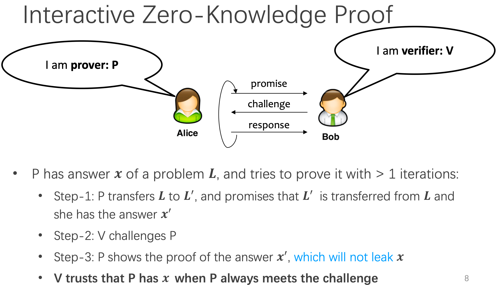

# 14. Data Privacy

**Protecting Your Data** from Anyone!

 What’s the target of **data privacy system**?

- **Allow** data to be **used**
- **Protect** data **from being stolen**

Basic data privacy **method** -> ZKP, OT, HE, sMPC, TEE, DP

**Systems** which try to enforce data privacy

## Zero-Knowledge Proof (ZKP)

 Alice tries **prove** to Bob that she has the answer to a difficult problem. 

### ZKP

- Completeness: Alice **can** construct the proof if she has A
  (You **can** prove anything that’s right)
- Soundness: Alice **cannot** construct the proof if she doesn’t have A
  (You **cannot** prove anything that’s wrong)
- Zero-Knowledge: Bob knows **nothing about A**.  [link](https://towardsdatascience.com/what-are-zero-knowledge-proofs-7ef6aab955fc)

### Interactive Zero-Knowledge Proof

[link](http://gauss.ececs.uc.edu/Courses/c6053/lectures/PDF/zero.pdf)

## Oblivious Transfer

What’s oblivious transfer?

The simple protocol: 1-out-of-2 Oblivious Transfer

Actually, there are more OT protocols

- Different number of selected messages
  - 1-out-of-2 OT
  - O-out-of-n OT
  - K-out-of-n OT
- Implementation method
  - Non-adaptive OT
  - Adaptive OT
  - Public Verifiable OT

## Homomorphic Encryption

What’s homomorphic encryption?

SWHE (limited) and FHE (full)

[More detailed explanation in wikipedia](https://en.wikipedia.org/wiki/Homomorphic_encryption)

## Secure Multi-Party Computing

The problem is that multiparty want to work together to calculate a function

- But we need to enforce **data privacy** for each party

(Alice has data1 and Bob has data2, but they want to compute $f(data1, data2)$)

Yao’s Protocol

- Two party computing
- Semi-host adversary
  - Each party must **follow the protocol** 
- Generic protocol
  - Can securely compute **any functionality** 
- Garbled Circuits + Oblivious Transfer

Millionaire Problem

**Garbled Circuits** -> (Learn in the future) 

Good material from [ZHIHU](https://www.zhihu.com/people/li-tian-tian-13/posts)

## Trusted Execution Environment

But what’s trusted execution environment?

TrustZone divides one system to two worlds: normal world (REE) and secure world (TEE)

The normal world has three layers

- One for hypervisor
- One for kernel
- One for application

The secure world has three layers

- One for TEE OS
- One for TEE application
- Monitoring mode to switch between the two worlds (done through `smc` instruction)

## Differential Privacy

Allow user to perform a **random function** M on data set, but get nothing about **individual entry of D**

What is $\epsilon$ DP?

Secure properties

- Robustness to post-processing
  - You can perform any operations on the result of M, and **get nothing of individual entry of D**. 
- Composability
- Group privacy

When DP is enabled

But how to implement a DP algorithm?

- Adding noise to the function we want to compute
  - Translate function f into a random algorithm $M$
- Existing mechanisms
  - Laplace mechanism
  - Gaussian mechanism

## SAGE: Privacy Accounting and Quality Control in the Sage Differentially Private ML Platform

Sosp 2019

### Motivation

ML should capture general trends from the data, but often **captures specific information about individual entries** in the dataset.  

## Oblivious Multi-Party Machine Learning on Trusted Processors

USENIX Security 2016

### Motivation

Large attack surface: **sensitive data could be stolen**. 

### Threat model

Assumptions: 

- Code does not leak secrets 
- Do not consider leakage through out time or power channels
- Any party can be malicious

SGX’s Vulnerabilities

## Differential privacy systems

### Data privacy + ML

- Sage (SOSP 19)
- Oblivious multi-party ML (UNESIX Security 16)
- Chiron, ...

### Data privacy + Database

- CryptDB (SOSP 11)
- EnclaveDB (S&P 18)

### Data privacy + Data analysis

- Opaque(NSDI 17)

More ...

## Reference

1. [CSP Lecture 14](https://ipads.se.sjtu.edu.cn/courses/csp/slides/CSP_14_Data_Privacy.pptx)

