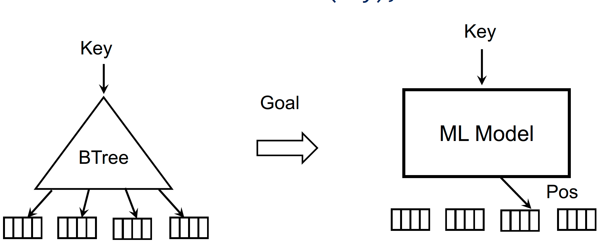
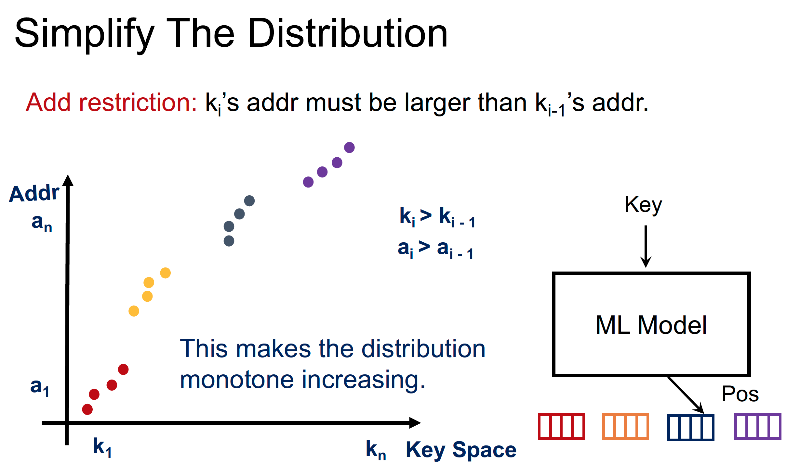
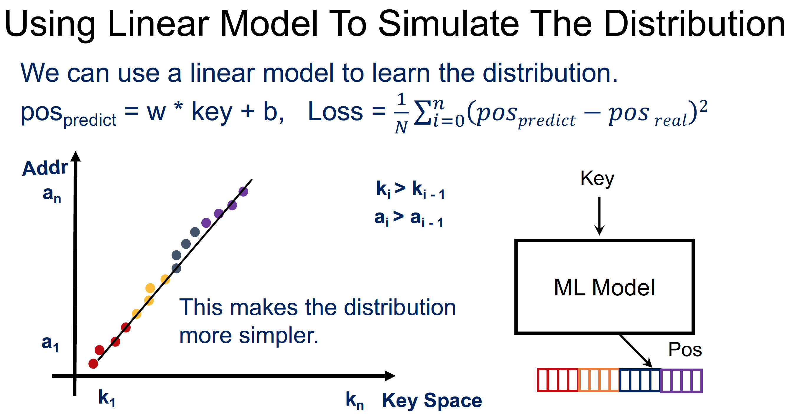
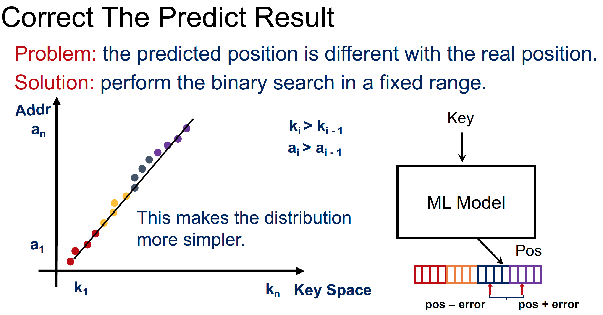
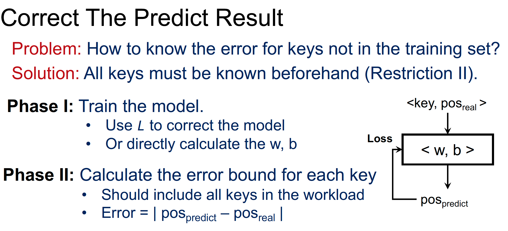
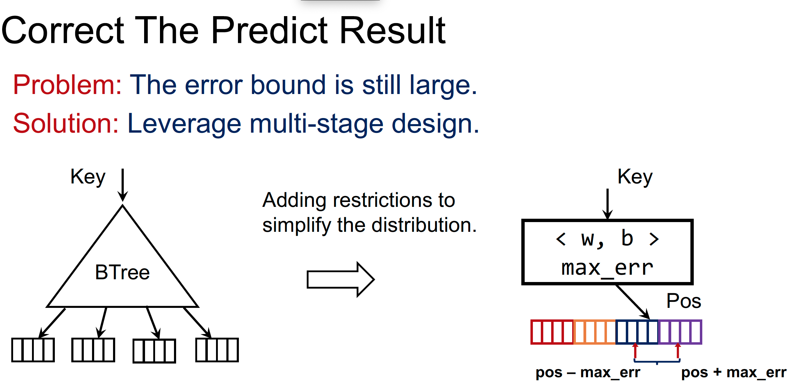
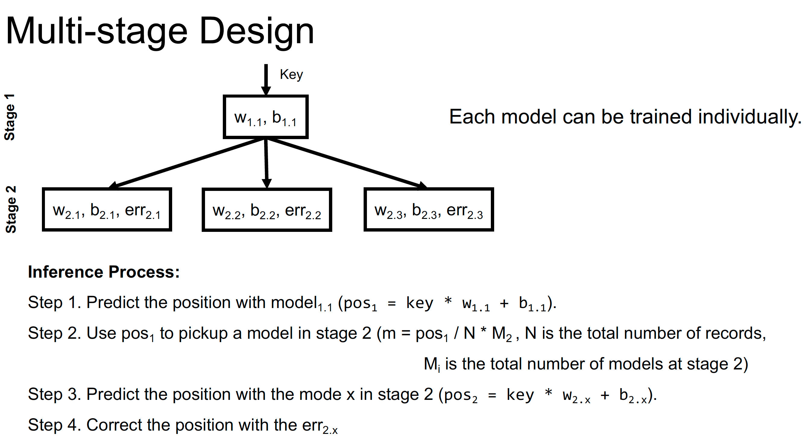

# 16. How does ML benefit traditional data structure?

Questions to answer

1. How to index data with ML models? -> Learned index (SIGMOD 2018)
2. How does it benefit the performance?
3. What are the limitations?
4. How to break the limitations?

XIndex(PPoPP’20)  answered the last three questions...

## How to index data with ML models?

Replace $B+$ Tree with machine learning model -> index can be considered as $addr = f(key)$ , which we should learn. 

But sometimes the distribution looks to be complicated, we need to use complex model to simulate the distribution...

Actually we need to simplify the distribution, so we add an extra condition

More restriction : the entire memory should be Contiguous...

We can use a linear model to simulate the distribution...

But some times there may be some error.. So we still need to perform binary  search in a fixed range. 

And so we can correct the prediction result since all keys must be known beforehand

Use multi-stage design to correct the predict result...

## How does it benefit the performance?

Learned index has better performance for large dataset. 

### **Small dataset**

For single query, learned index executes more instructions with **higher CPI** comparing B-Tree. 

### **Large dataset**

For single query, learned index executes less instructions with **better cache locality**. 