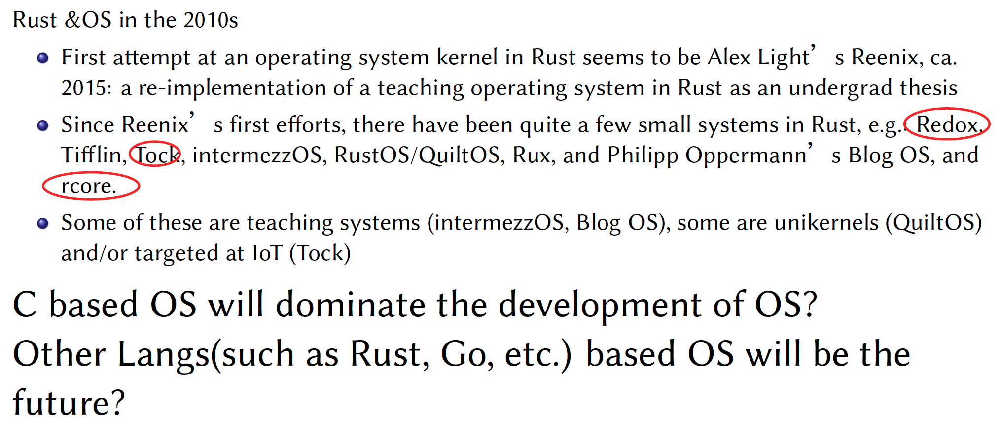

# 17. The Programming Language of OS

## Introduction

1. Some questions
   - Is Programming Language **important for OS**?
   - Is C **the best language of OS**?
   - Which parts of language affect OS deeply?
   - Other than languages, which components affect the development of OS?
   - Why do we need/needn’t to change the language for OS?
   - Other Langs(such as Rust, Go, etc.) based OS will be the future?

2. What is OS?
   

   

   What is the Programming Language?
   

   What is the Programming Languages for OS?
   

   What is System Programming language?
   

   - Focus on performance, reliability
   - Java is not a system programming language and Java is a general programming language. 

   

   

   - C is both system programming language and **general programming language**
   - More focus on **performance**

   Major System Programming languages
   

3. Some OS based on Non-C language
   

## History

1. MCP & ESPOL
   

   

2. MULTICS OS & PL/I language
   

   ​	

   

3. UNIX & C
   

   

   

   ​	

   

   

   

   

   