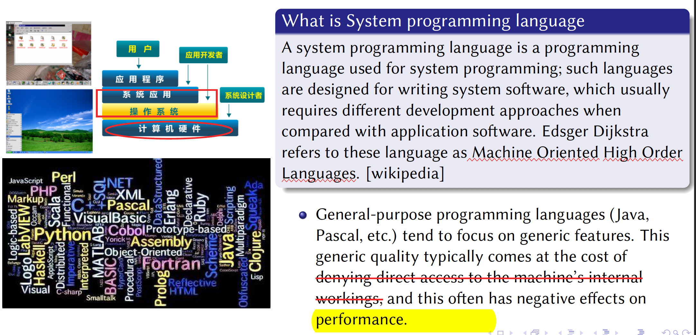
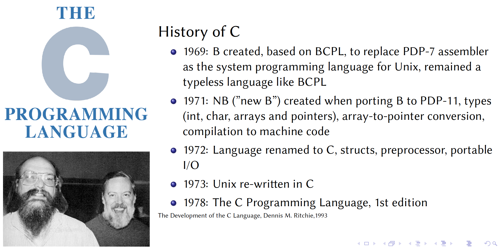
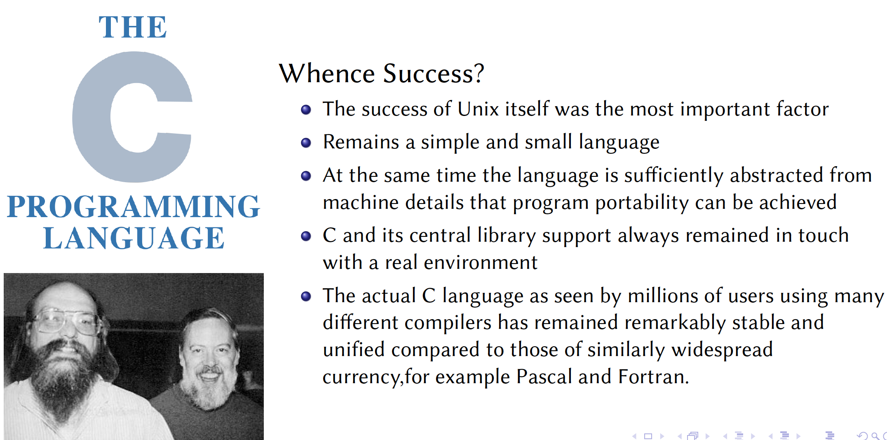
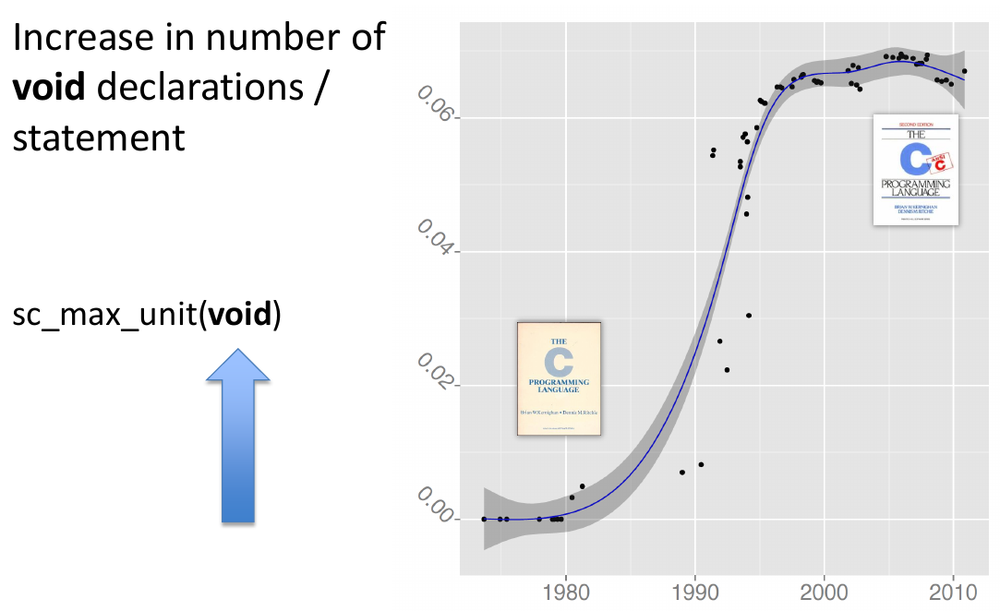
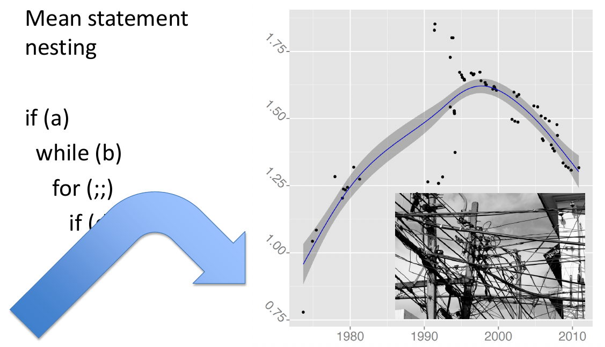
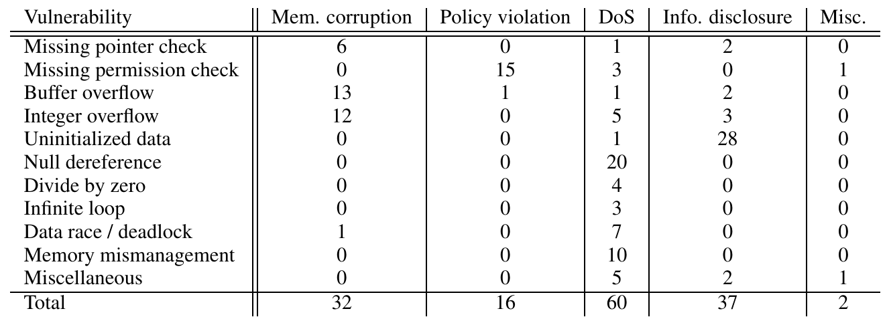

# 17. The Programming Language of OS

## Introduction

1. Some questions
   - Is Programming Language **important for OS**?
   - Is C **the best language of OS**?
   - **Which parts of language** affect OS deeply?
   - Other than languages, **which components affect the development of OS**?
   - Why do we need/needn’t to **change the language for OS**?
   - Other Langs(such as Rust, Go, etc.) based OS will be the future?

2. What is OS?
   

   

   What is the **Programming Language**?
   

   What is the **Programming Languages for OS**?
   

   What is System Programming language?
   

   - **Focus on performance, reliability**
   - Java is not a system programming language and **Java is a general programming language.** 

   

   

   - C is both system programming language and **general programming language**
   - More focus on **performance**

   Major System Programming languages
   

3. Some OS based on Non-C language
   

## History

1. MCP & ESPOL
   

   

2. MULTICS OS & PL/I language
   

   ​	

   

3. UNIX & C
   

   

   

   ​	

   

   

   

   

   ## The Evolution of C Programming Practices: A Study of the Unix Operating System 1973-2015

   ### History of C

   1. History of C
      
   2. Why was C be used to develop Unix?
      
      - B’s performance is not good as **compiled language**. It not generated machine code.
      - Another successful reason is `DEC VAX 11/780` becoming popular. 
      - The product of **compiler**, **OS**, **hardware** made the success

3. Why C ?
   
   - **Close to machine** abstraction
   - **Type safety** => solve bugs in **compiler level**
   - **Small and Simple** => Use big library to **implement complex algorithms**

4. Why success?
   

   - The core of C is very **stable**. 

     

### A study of the Unix Operating System 1973-2015

1. Objective
   

2. Hypothesis
   

   **From software engineering perspective**

3. Timeline of indicative **analyzed revisions** and **milestones** in (from top to bottom): **C language evolution**, **developer interfaces**, **programming guidelines**, **processing capacity**, **collaboration**, **mechanisms**, and **tools**.
   

4. Code size changing
   

5. H1: Programming practices reflect technology affordances

   - Increase in mean file length (lines / file)
     

   - Increase in mean file functionality (statements / file)
     

   - Increase in mean line length (characters / line)
     

   - Increase in mean identifier length (characters / line)

     

   - Increase in mean function length (lines / function)

     

   H2: Modularity increases with code size

   - Increase in number of **static** declarations / statement

     

   - Increase in number of `#include` directives

     

   H3: New language features are increasingly used to saturation point

   - Increase in number of **const** declarations / statement
     
   - Increase in number of **enum** declarations / statement
     
   - Increase in number of **inline** declarations / statement
     
   - Increase in number of **void** declarations / statement
     
   - Increase in number of **volatile** declarations / statement
     
   - Increase in number of **unsigned** declarations / statement
     

   H4: Programmers trust the compiler for register allocation

   - Decreasing number of **register** declarations / statement
     

   H5: Code formatting practices converge to a common standard

   - Decrease in code **inconsistency**
     
   - Decrease in **indentation spaces** standard deviation
     

   H6: Software complexity evolution follows self correction

   - Mean lines / function
     
   - Mean statement nesting
     
   - Density of C preprocessor conditonals 
     
   - Density of C preprocessor non-include directives
     
   - **goto** keyword density
     

   H7: Code readability increases

   - Mean indentation spaces converge around 6
     
   - Statements / line decrease
     
   - Comment character density
     
   - Kluge word density
     

## A Study of Bugs on Linux

### Introduction

Why study faults/bugs/Vulnerabilities in OS code?

- Find the relation between **language** and **OS**

Some questions

- **Where are the errors?**
  - Driver code has error rates three to seven times higher for certain types of errors than code in **the rest of kernel**
- **How are bugs distributed?**
  - The error distribution is readily matched to a logarithmic series distribution
- **How long do bugs live?**
  - the average bug lifetime for certain types of bugs is about 1.8 years.

### 19 years ago

1. Linux Code Base Growth
   

   The twelve bug checkers
   

2. **Drivers are the one major source of bugs in operating systems**

   

   - `Minix 3`: microkernel
   - `Singularity`: use another language writing OS kernel
     - Not good performance
     - Bad backward compatibility

3. Deadlock/data race related bugs
   

   - `kmalloc` may sleep

4. NULL/Free related bugs
   
   
   - Garbage collection language may prevent these problems..
5. Var related bug
   
   - User-mode application stack will grow as demand increase
   - Kernel stack has **fixed** size
6. Range related bugs
   
   
   - Java / C# will provide boundary check but not good performance. 

### 9 years ago

1. Line of Code in Linux

   

2. Comparative fault count
   

   - With code complexity increases, bugs still exist. 

   Per finding and fixing difficulty, and impact likelihood
   

3. Linux kernel vulnerability
   

   

4. Hard to find bugs even with advanced tools
   

   - Root cause is **C language** 
   - Semantics bug in C -> **buffer overflow**, **uninitialized data**

## The benefits and costs of writing kernel in a high-level language

1. Should we use high-level languages to build OS kernels?

   - Pros

     - **Easier to program**
     - **Simpler concurrency with GC**
     - Prevents **classes of kernel bugs**

   - Downside

     - Bounds, cast, nil-pointer checks
     - **Reflection**
     - **Garbage collection**

     

2. Goal: measure HLL impact

   - Pros
     - **Reduction of bugs**
     - **Simpler** code
   - Cons
     - **HLL safety tax**
     - **GC CPU and memory overhead**
     - **GC pause times**

3. **Methodology**

   - None measure HLL impact in a monolithic POSIX kernel
   - Build new HLL kernel, compare with Linux
   - Isolate HLL impact
     - **Same apps, POSIX interface, and monolithic organization**

   

4. Why Go-lang?

   - **Easy to call asm**
   - **Compiled to machine code with good compiler**
   - **Easy concurrency & static analysis**
   - **GC**
     - **Concurrent mark and sweep**
     - Stop-the-world of 10s of us

5. Biscuit
   

   

   - Can’t allocate heap memory ==> nothing works

   - All kernel face this problem
     

     

     - Sleep with lock => deadlock

     

     - Use static analysis to reserve **memory size**
     - Combination of static analysis and **dynamic runtime**

     

     - **RCU** is good for parallel
     - More on **optimizations** (algorithm and hardware), not use feature of HLL
     - **HLL** is only for reducing bugs.

     

6. Evaluate 
   

   

7. Conclusion
   

   