# Lecture 18: The interface of OS

## Introduction

1. The definition of interface
   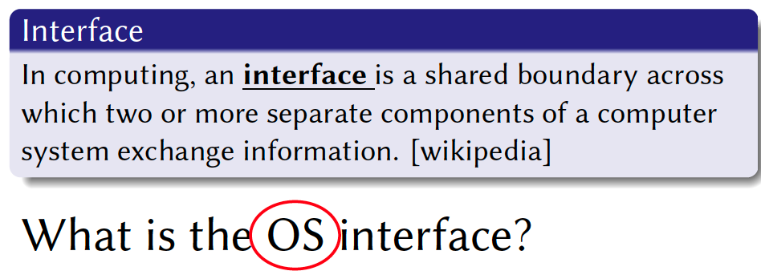

2. API
   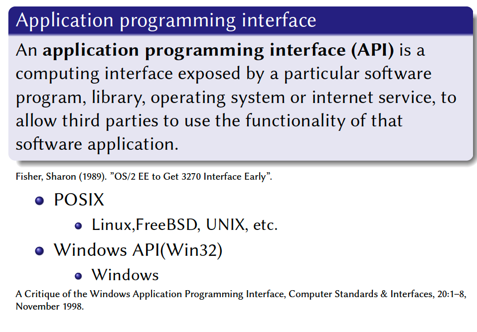

   Two kinds of OS interface

   - POSIX
   - Windows API (Win32) 

3. Implementation of APIs is the **lesser** problem

   - Performance can be improved later; bugs are irritating, but can be **fixed**

   API design is the **big** problem

   - Bugs
     - Developer misunderstood API
   - Performance
     - Transferring data (streaming or not?)
   - Many apps will be affected 
     - ABI: application binary interface
     - Change OS is hard

4. Why is API design a problem?
   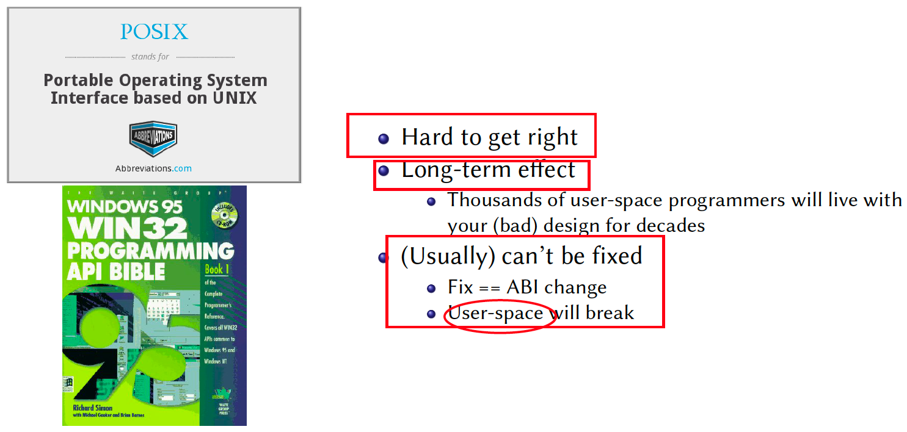

   - OS is a long term project and **hard to predict the future**
   - Want to extend one feature, old program will break!
     - Developer are unhappy!

5. Win32 API: From the view of software engineering

   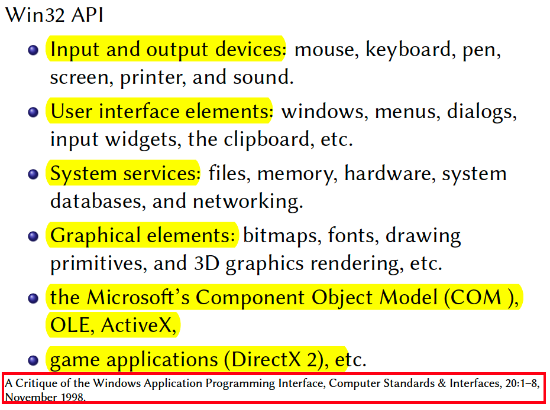

   Elements
   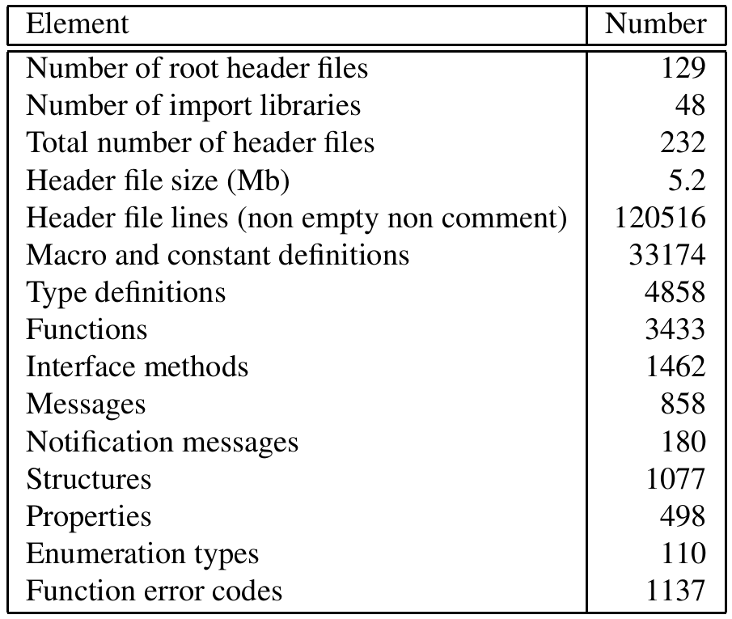

   - More than 3000 functions, more than 1000 error codes

   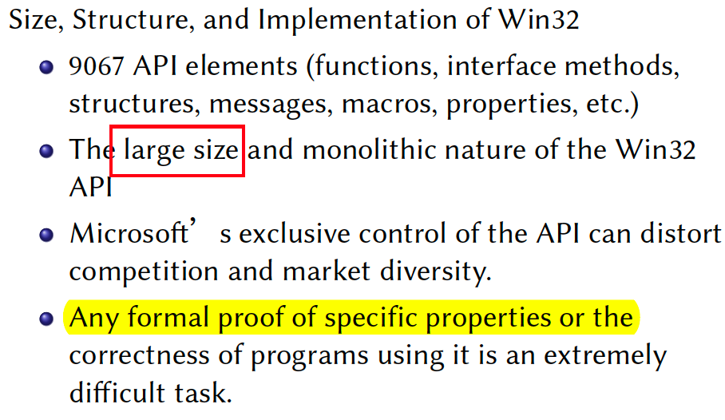

   - Clear API description => formal proof will make less bugs, and better API design (may improve performance)

   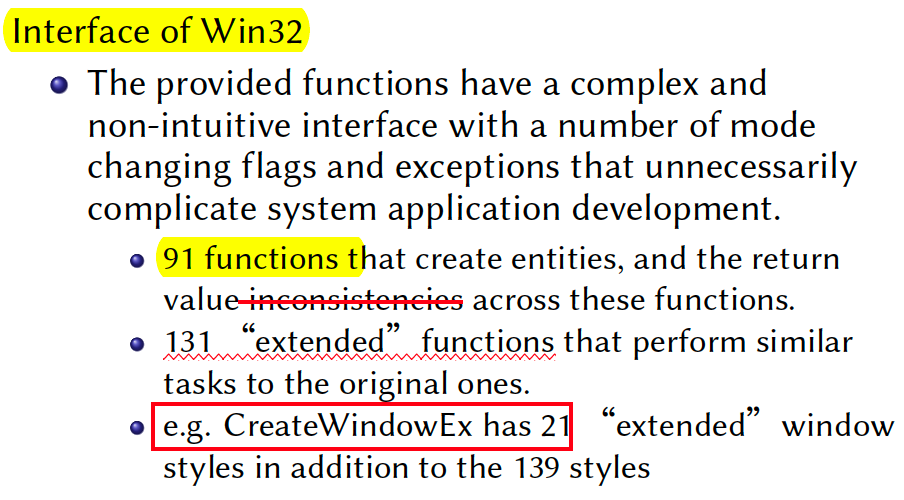

   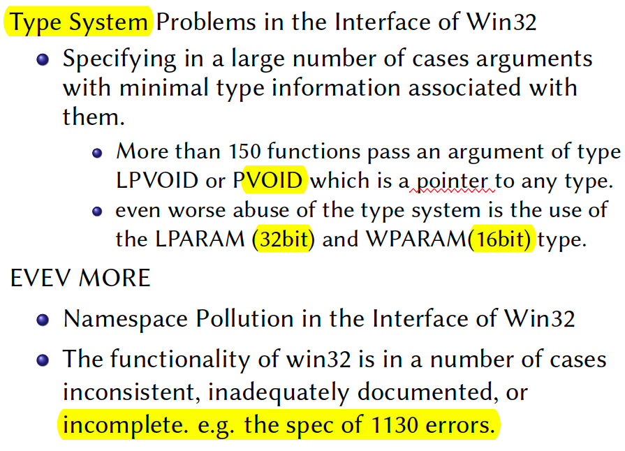

   - VOID pointer can point to any type
   - Windows is a process of development. (From DOS). It can’t even imagine the need of future. 
   - Windows use C language (pointer is flexible). Flexible, but high risks. 
     Type system problem may be the fault of C programming language. 

## Overview of POSIX

### History

1. First Research Edition
   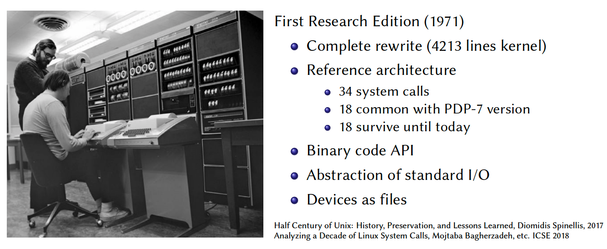

2. FreeBSD’s system call evolution
   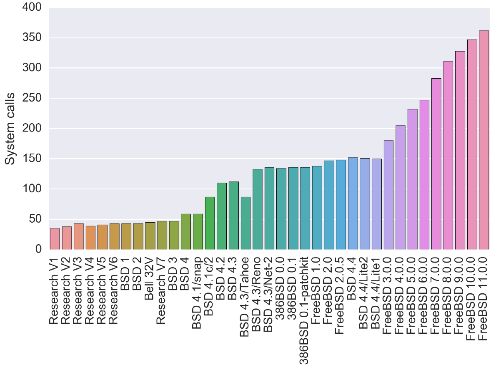

   C library functions
   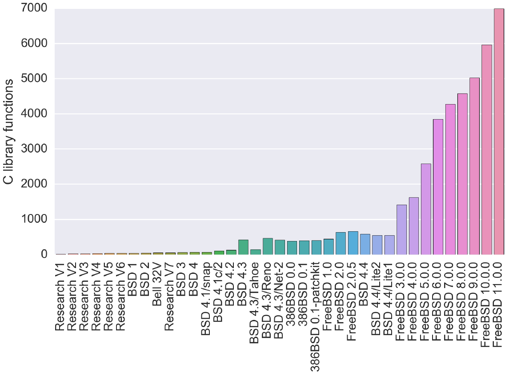

3. The sequence of system call
   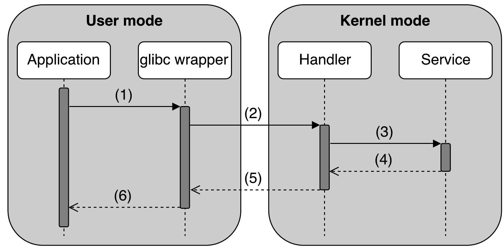

   An overview of syscall data collection
   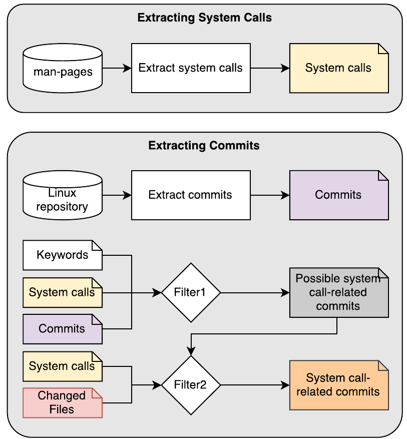

   - `man 2 write`
   - Find `syscall` related commits

4. An overview of `syscall` empirical study
   

5. System call categories
   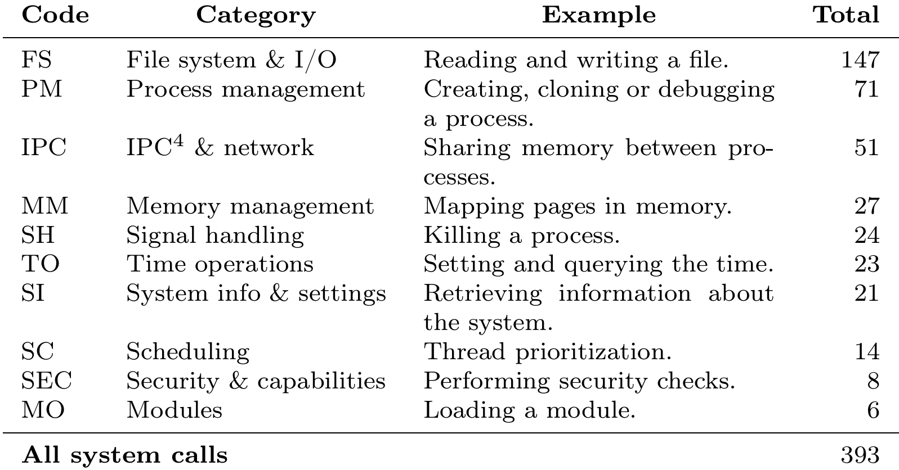

   - Lack `gui` `syscall`
   - Lack IPC `syscall`

   Sibling `syscalls`
   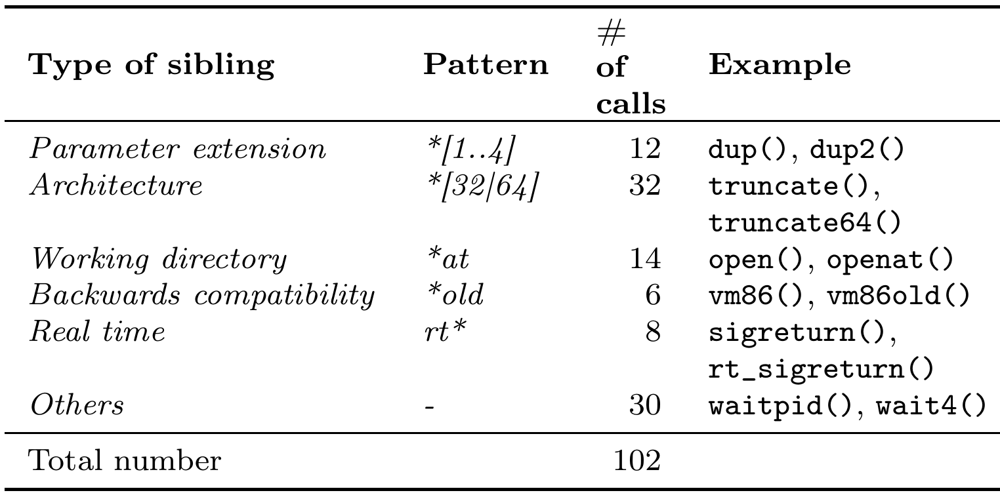

    
   
   - Real time system calls have `rt` as prefix
   
   **New system calls**
   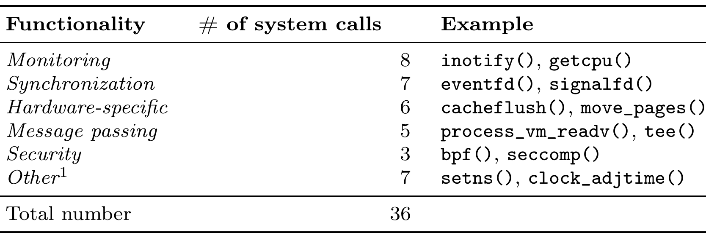
   
   - New feature for server 
   - Adding new system calls to satisfy the need of user
   
6. Classifying of Decade of System Call Commits
   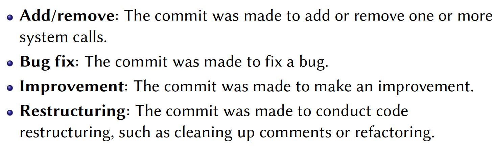

7. The system calls with the most commits
   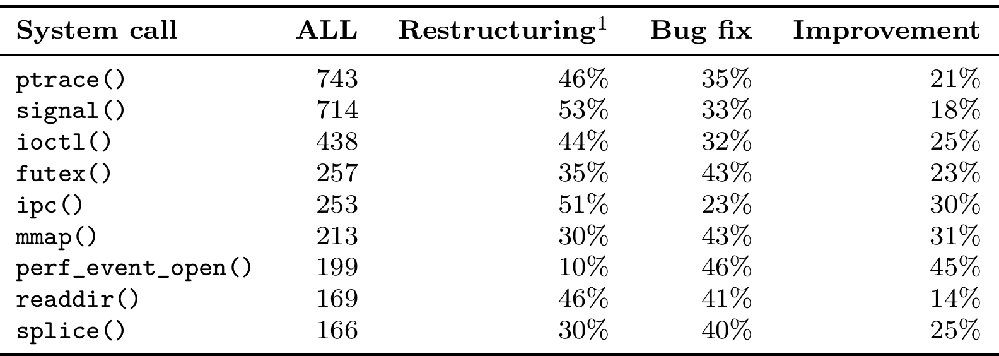

   - `ptrace` and `signal` are very complex. 

8. Classifying Bufflehead Fixes of `Syscalls`
   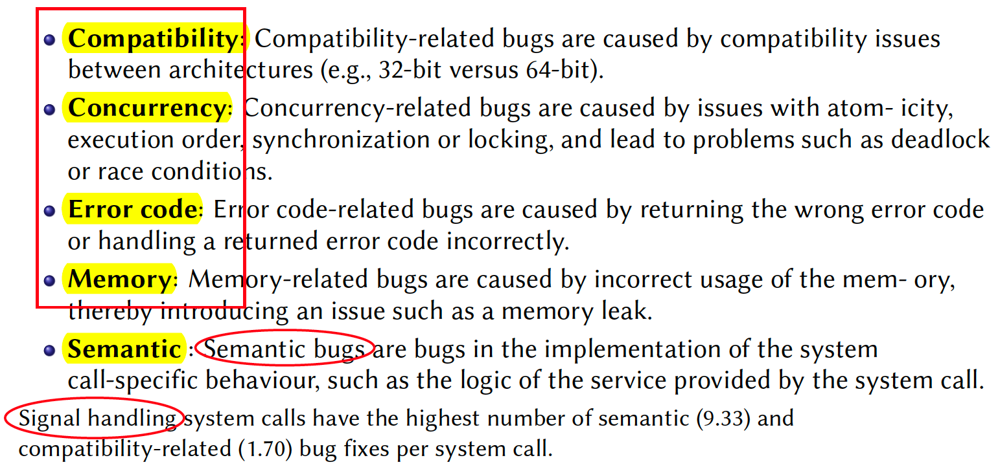

   - Concurrency bug is hard to reproduce
   - Semantic bug (not as expected)

9. Classifying Bug Fixes of Syscalls
   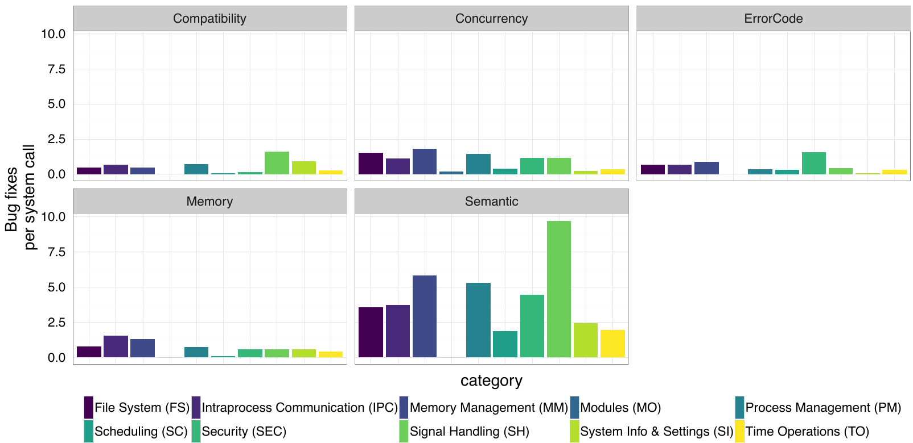

   - Signal handling system calls have the highest number of semantic (9.33) and compatibility-related (1.70) bug fixes per system call
   - Driver bug is not considered. 