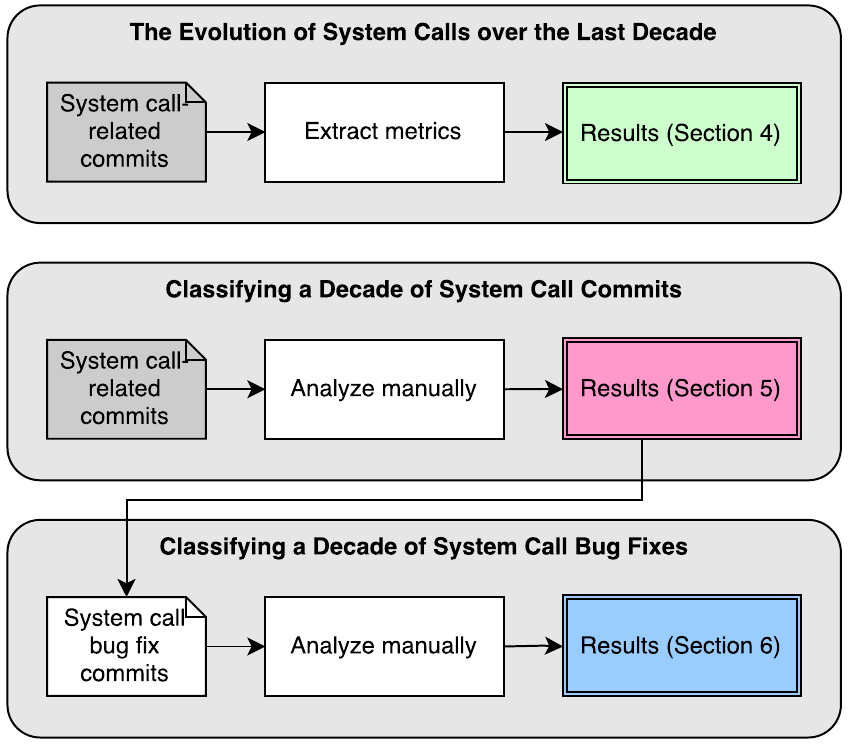
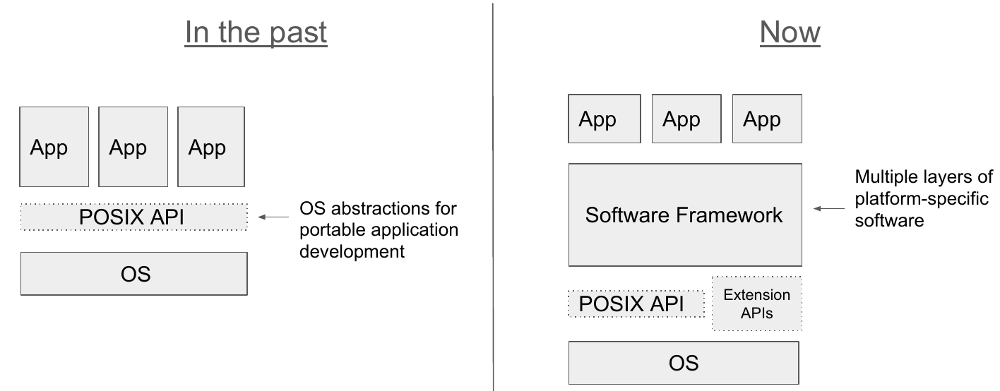
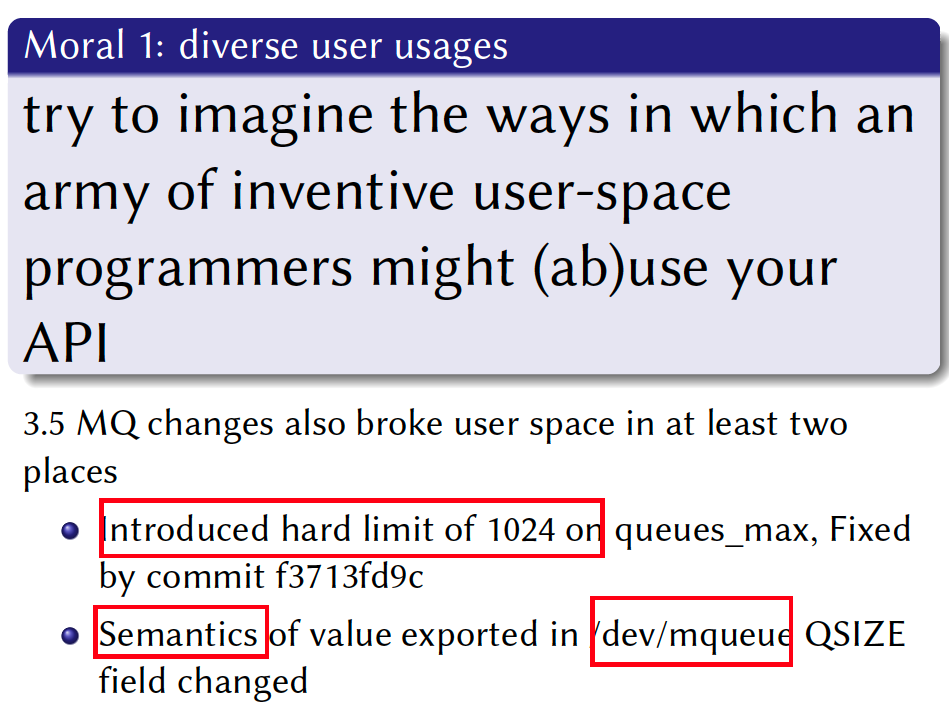

# Lecture 18: The interface of OS

## Introduction

1. The definition of interface
   

2. API
   

   Two kinds of OS interface

   - POSIX
   - Windows API (Win32) 

3. Implementation of APIs is the **lesser** problem

   - Performance can be improved later; bugs are irritating, but can be **fixed**

   API design is the **big** problem

   - Bugs
     - Developer misunderstood API
   - Performance
     - Transferring data (streaming or not?)
   - Many apps will be affected 
     - ABI: application binary interface
     - Change OS is hard

4. Why is API design a problem?
   

   - OS is a long term project and **hard to predict the future**
   - Want to extend one feature, old program will break!
     - Developer are unhappy!

5. Win32 API: From the view of software engineering

   

   Elements
   

   - More than 3000 functions, more than 1000 error codes

   

   - Clear API description => formal proof will make less bugs, and better API design (may improve performance)

   

   

   - VOID pointer can point to any type
   - Windows is a process of development. (From DOS). It can’t even imagine the need of future. 
   - Windows use C language (pointer is flexible). Flexible, but high risks. 
     Type system problem may be the fault of C programming language. 

## Overview of POSIX

### History

1. First Research Edition
   

2. FreeBSD’s system call evolution
   

   C library functions
   

3. The sequence of system call
   

   An overview of syscall data collection
   

   - `man 2 write`
   - Find `syscall` related commits

4. An overview of `syscall` empirical study
   

5. System call categories
   

   - Lack `gui` `syscall`
   - Lack IPC `syscall`

   Sibling `syscalls`
   

    
   
   - Real time system calls have `rt` as prefix
   
   **New system calls**
   
   
   - New feature for server 
   - Adding new system calls to satisfy the need of user
   
6. Classifying of Decade of System Call Commits
   

7. The system calls with the most commits
   

   - `ptrace` and `signal` are very complex. 

8. Classifying Bufflehead Fixes of `Syscalls`
   

   - Concurrency bug is hard to reproduce
   - Semantic bug (not as expected)

9. Classifying Bug Fixes of Syscalls
   

   - Signal handling system calls have the highest number of semantic (9.33) and compatibility-related (1.70) bug fixes per system call
   - Driver bug is not considered. 

## POSIX in modern OS

1. Introduction
   

   - Modern OS: Android, IOS ...
   - Modern workloads: WeChat, Twitter ..
   - Some unpopular POSIX abstractions and what we need to have ?

2. Workloads & Methodology
   

   - Ubuntu is not so modern ...

3. Question 1
   

   - **Large numbers of unused or unimplemented abstractions**, Departure from traditional IPC and

     async I/O

   - IPC is not widely used..

4. Question 2
   

   - IOCTL: Extension API used to shortcut POSIX; Directly interact with the kernel; Build

     functionality not expressed from POSIX APIs

     - Read special file ..
     - GPU is controller by IOCTL

   - THREAD => more effective and high performance

5. Question 3
   

   - POSIX not provided GUI abstraction
   - GPU is not block device, or character device … => so we need too use IOCTL
   - Binder IPC is more high performant. 
     - Not only transferring data
     - But also interact with other processes

6. Evolution of systems and applications
   

   

## How to design a Linux kernel interface?

1. The Linux Programming Interface
   
2. Moral 1: diverse user usages
   
   - The max size of queue is 1024 => to small for nowadays usage
   - **Semantics has changed**...
3. Moral 2: unit tests
   
4. Moral 3: Specification
   
   - Now description is based on human language => also Leeds some bugs
5. Moral 4: feedback loop
   
6.  Moral 5: Into real world
   
   - In real word usage, we can find the bug
7. Moral 6: technical checklist
   
   - Extensibility is **important**

## Interface of Performance

1. Three papers want to change the system call
   
   - `Flexsc`: **change sys call from sync to async**
   - MegaPipe: change syscall interface to **utilize high performant Network I/O**
   - Make `syscall` **better on multi-core**
2. Improve performance
   - Sync system call is a legacy
   - Syscall is not for high-speed net
   - Syscall is not for multicore arch
     - The **semantic** of syscall

### FlexSC

1. Sync => Expensive
   
2. Processor structure pollution is **bad** !
   
3. Key source of performance impact
   
   - IO operation => switch process => TLB miss ...

4. Exception-less syscalls
   

   Contributions: **Exception-less sys calls** & **FlexSC-Threads**
   

   

   - Use `perf` tool to find CPU inside data
   - Core idea: async + batch processing + share memory + core specialization
   - Complex: need to change `glibc` … Mainly reduce user-mode switch cost but not processor pollution structure cost ...

   ### MegaPipe

   1. Introduction
      

      - Different message size 
        - low message size => low throughput
        - Large message size => low CPU usage

      - Multicore => we want ideal scaling

   2. BSD Socket API Performance Issues
      

      - `listen_fd` => share data structure (write sync cost)
      - File abstraction => VFS overhead & lock overhead

      MegaPipe
      

      - Each core has one listen socket … (reduce shared socket overhead)
      - Bypass VFS => use light weight socket!

   3. Left: traditional design, right: Mega Pipe Design
      

   4. Completion Notification Model
      

   5. Multicore scalability

      

      

   ### Commuter

   1. The real bottlenecks may be in the **interface design**

      

      - ‘Create(x)’ => the smallest integer as `fd`
        - Traditional multiple `create` commands => need a global lock
      - Now change `Create(x)` => the usable integer is OK
        - Now parallel is possible

   2. Commute rule
      

   3. Design & Implement & Test
      

   4. Formalizing the rule
      

      Example
      

       

   5. An example of commuter
      

      Using the rules to build the scalable OS
      

       

      

   6. Refining the POSIX with the rule
      

      

