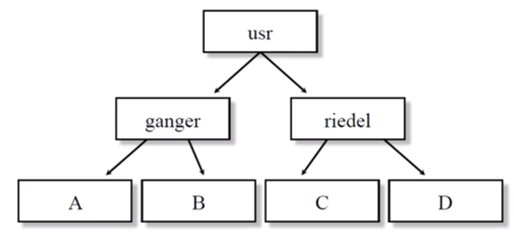
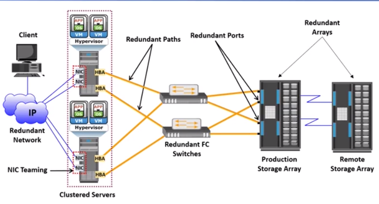
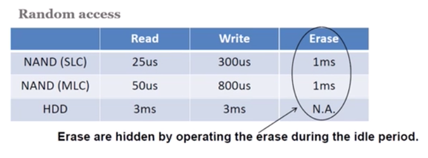
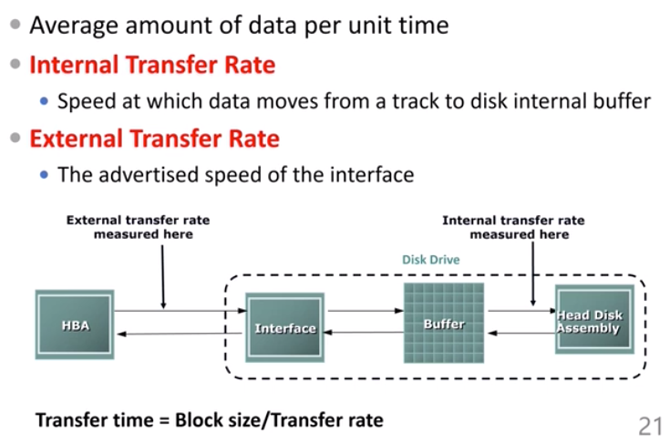

# Lecture19: Storage Technique

## Introduction

### When you choose a storage system

1. **Common storage media**
  - SRAM
  - DRAM
  - Disk (HDD)
  - SSD (Flash memory)
  - NVM
  - PCM
  - RRAM
  - MRAM
  - CD
  - DVD
  - Tape

2. **From software level** (storage system)
  - Key-value , file system

  - Distributed system

  - Reliability, consistency, fault tolerance, replication
  
	- Consistency and reliability
	
	- File access mode (big file. Small file and access frequency)
3. **Which storage system you choose**?
  - SAN
    - Storage area network
    - Block granularity
  - NAS
    - File granularity
  - HDFS
    - Open source version of Google file system

4. How large do you need?
  - 1TB
  - 10TB
  - 1PB
  - 100PB

5. I/O 500 system

   - Data + metadata
   - SSD + local / distributed file system
   - NVM (3D XPoint)
     - 128GB - 512GB
     - High performance

4. From CPU-intensive computing => **data-intensive** computing

   - Data size growth >> storage size growth

### What’s storage system?

5. Computer system

   - CPU
   - IO system
   - Storage system
     - Disk 
     - memory
     - Register

   GAP between IO and CPU
   

   - Memory bandwidth and memory bandwidth => bad
   - Network latency and Disk latency => worse

6. What are storage system all about?

   - Memory / storage hierarchy

     - Combining many techniques to balance costs/benefits
     - Similar to cache design for CPUs, but Important differences
     - **Exploit locality** to get the best of both worlds
       - Locality = re-use / nearness of accesses
       - Allows most accesses to use small, fast memory
     - No longer the focal point of storage system design
       - Still important though

     

     

     - SRAM big area, but high performance (compared to DRAM)
     - NVM between DRAM and local disks

     

7. Levels in typical memory hierarchy
   

   - NVM: 300ns
   - SSD: 30 micro second

   Memory access process
   

   - Between DRAM and CPU cache => hardware
   - Between DRAM and HDD => software

   Logical Program Addressing
   

8. Persistency

   - Storing data for length periods of time
   - To be useful, it must be also possible to find it later again
     - This brings in data organization, consistency and management issues
   - This is where the serious action is
     - And it does relate to the memory / storage hierarchy

   Storage system interface
   

9. Software interface layers
   

   Organizing names: Directory Hierarchy
   

   File system structure
   

   OS sees storage as linear array of blocks
   

   In device, blocks mapped to physical store (sector # => cylinder , patter, tack, sector)

   

   Physical interconnects
   

   Computer system components
   

   Storage subsystem components
   

   - System bus: PCIe
   - I/O Bus: SATA

10. Storage characteristic

    - Reliability (use redundant data)

      - Replication
        - HDFS: one data, three copy
      - Checksum

      

    - Consistency

      - Atomic (All or none) + consistency

    - Fault tolerance and replication
      

      Resolving single point of failure
      

### History

1. Storage medial history
   

   - Now flash memory & Persistent memory
   - Flash memory => SSD
   - Persistent memory => 3DXPoint (hot topic)

2. Technical specification - Then and Now
   

   - 2013 => 3.5 in

   

   - Hard disk drive area density
     
   - Performance gap between disk and dram
     
     - DRAM: 10ns
     - Disk: ms 
   - Interface: from parallel to serial
     
     - Parallel: single skew is bad
     - Performance
       

3. SSD
   

   - Bandwidth 30x
   - Latency: 1 / 100

4. Solid State Storage
   

   - HDD => mechanism
   - SSD => electronic 

   From 1 bit / cell => 2 bit / cell
   

   - SSD NAND Flash

5. HDD VS. SSD
   

   - SSD => read / write (huge latency difference)
   - Overwrite => Erase + write (characteristic)

   

   SSD Market trends
   

6. Networked storage
   

7. Distributed file system

   

8. Key-Value storage
   

9. Cloud storage
   

## Disk Technologies

Reference book: Memory systems, Cache, DRAM, Disk

1. The history of storage media
   

   - HDD: magnetic
   - Flash memory ==> SSD
   - Persistent memory (NVM) => new break through

2. Today we have

   - HDD
   - Flash memory
   - Persistent Memory

3. The first commercial Disk Drive

   - Big size
   - Small storage

   First Air Bearing Heads (1962)

   First Removable Disk Drive (1965)

   First Modern Hard Disk Design (1973)

   - “Winchester”

   First Thin Film Heads (1979)

   Giant Magneto Resistive (1997)

### Disk components and their functions

1. Construction and Operation
   
2. Moving-head Disk Mechanism
   
3. Disk Device Components
   
4. Logical Block Addressing
   
   - CHS: Cylinder, Head, Sector

### Disk performance and how it is measured

1. Performance

   - Electromechanical device
     - Impacts the overall performance of the storage system

   - Disk service time

     - Time taken by a disk to complete an I/O request

       - Seek time (bottleneck1)
         

         - Full stroke (from outermost to innermost)
         - Average..
         - From one track to another track

       - Rotational latency (bottleneck2)

         

       - Data transfer time 

         - Data Transfer rate
           
           - External rate: SATA version ..
             External rate : lower compared to internal rate (used to calc the transfer time

2. Controller overhead can be omitted...
   

3. Where does the disk head’s time go?
   

   - Rotational latency + seek time > accounts most of the time

4. Impact of request size
   

   - Batch reading / writing

### Disk drive firmware algorithms

## Local strorage system

