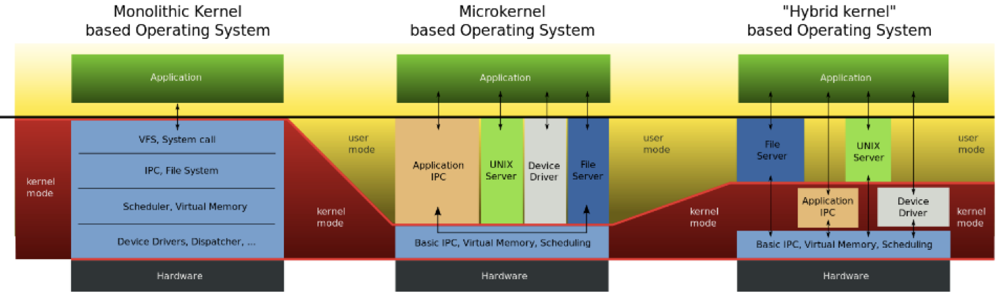
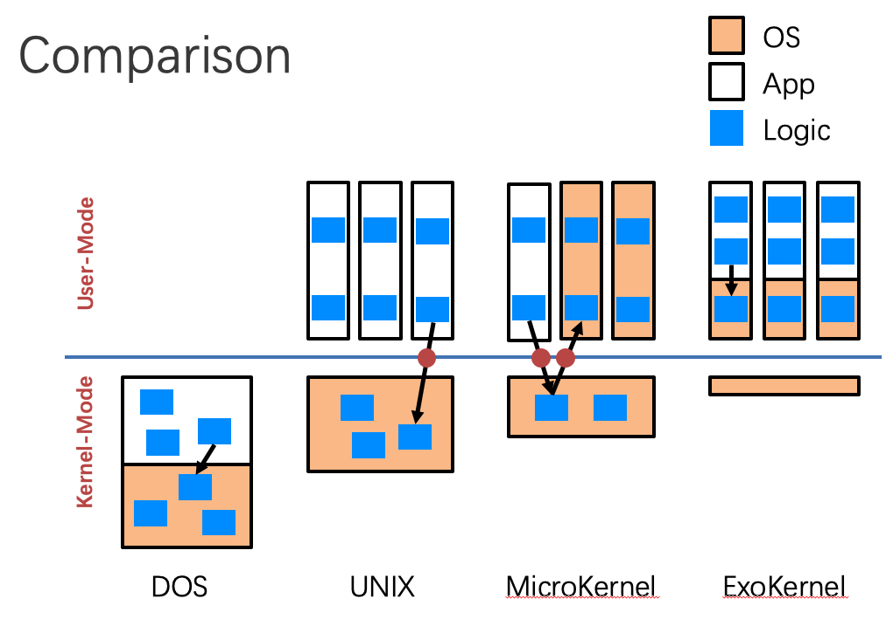

# 2. OS Structure

## Exokernel

Compare three different kinds of kernels

### Traditional OS

1. Only privileged servers and the kernel can manage system resources
2. Both resource management & protection are done by kernel
   - Centralized control
3. Untrusted applications are limited to the interface
   - Limited functionality
   - Hurt application performance
   - Hide information (page fault etc.)
4. An interface designed to accommodate **every** application
   - Flaw actually
5. Solution
   - Allow applications enough control over resources
   - Separating application from management

### The idea behind exokernel

1. Separate resource management from protection

2. **Kernel**: only protect resources

3. **Application**: only manage resources

4. Specialisation is common

   - Application spécialization
     - Millions of apps
   - OS specialization 
     - For server, desktop, phone … and more
   - Hardware specialization
     - CPU, GPU, ...

5. OS as a library

   - Different libos can coexist on the same **exokernel**

   

### Exokernel: Design Challenge

1. Kernel’s new role
   - Tracking ownership of resources
   - Ensuring resources protection
   - Revoking resource access
2. And smart guys introduce three techniques
   - Secure binding
   - Visible revocation
   - Abort protocol

### Exokernel: Principles

1. Separate resource protocol and management
2. Expose allocation
3. Expose names
4. Expose revocations
5. Expose information

### Exokernel: Benefits

1. Expose kernel data structure
   - Without lots of system calls
2. Flexibility
   - Libos can modified and debugged more easily
3. Performance improvement

### Exokernel: Drawbacks

1. The interface design is not simple
2. The ease of creation and mixing libOSes could lead to code messes
3. Customer support is harder than before
   - What’s OS you are choosing?