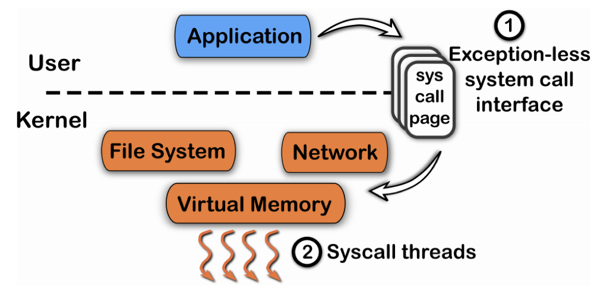
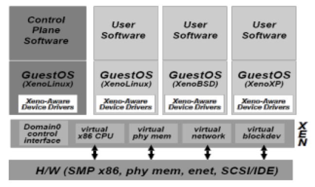

# 2. OS Structure

## Exokernel

Compare three different kinds of kernels

### Traditional OS

1. Only privileged servers and the kernel can manage system resources
2. Both resource management & protection are done by kernel
   - Centralized control
3. Untrusted applications are limited to the interface
   - Limited functionality
   - Hurt application performance
   - Hide information (page fault etc.)
4. An interface designed to accommodate **every** application
   - Flaw actually
5. Solution
   - Allow applications enough control over resources
   - Separating application from management

### The idea behind exokernel

1. Separate resource management from protection

2. **Kernel**: only protect resources

3. **Application**: only manage resources

4. Specialisation is common

   - Application spécialization
     - Millions of apps
   - OS specialization 
     - For server, desktop, phone … and more
   - Hardware specialization
     - CPU, GPU, ...

5. OS as a library

   - Different libos can coexist on the same **exokernel**

   

### Exokernel: Design Challenge

1. Kernel’s new role
   - Tracking ownership of resources
   - Ensuring resources protection
   - Revoking resource access
2. And smart guys introduce three techniques
   - Secure binding
   - Visible revocation
   - Abort protocol

### Exokernel: Principles

1. Separate resource protocol and management
2. Expose allocation
3. Expose names
4. Expose revocations
5. Expose information

### Exokernel: Benefits

1. Expose kernel data structure
   - Without lots of system calls
2. Flexibility
   - Libos can modified and debugged more easily
3. Performance improvement

### Exokernel: Drawbacks

1. The interface design is not simple
2. The ease of creation and mixing libOSes could lead to code messes
3. Customer support is harder than before
   - What’s OS you are choosing?

## Flexible System Call

Flexible System Call Scheduling with Exception-Less System Calls, OSDI'10

### Motivation

1. How to further reduce the latency of `syscall`
   - Mostly of the state switch (from kernel mode to user mode)
   - Cache pollution
2. Could we do `syscall` without state switching?

### Overview

1. Introduce `system-call-page` that is shared by user and kernel
   - User threads can **push** the system call requests into the system call page
   - Kernel threads will **poll** the system call requests out the system call page
2. Another way of `syscall`
   

## Xen: The art of virtualization

### What is virtualization

1. What is virtualization
   - OS can run inside virtual machines, implemented by virtual machine monitors (VMMs)
   - Guest os
   - Host os
2. Virtual machines differ from physical machines
   - They don’t provide the guest OS exclusive access to underlying physical machine
   - They don’t provide the guest OS with privileged access to physical machine
3. The virtual machine monitor (VMM) is
   - A piece of software running on host OS
   - Can allow guest OS to be run as an application
   - Alongside with other applications

### Why virtualization

Coupling between hardware and OS

1. Hard to run multiple OS on the same machine
2. Difficult to transfer software updates setups to another machine
3. Messy to adjust hardware resources on system needs
4. Require static, up-provision of machine resources

Lack of true isolation between multiple applications

1. Operating system “leaks” a lot of information between processes through the file system and other channels
2. Multiple application may require specific software packages to run
3. Certain applications have very specific operating systems configuration and tuning requirements
4. In some cases, software vendors will not provide support if you are running their precious applications alongside **anything** else

### VMM

A software-abstraction layer that partitions the HW into one or more virtual machines

1. Fidelity
   - Executes identically as on real hardware
2. Performance
   - Achieve good performance on most instructions
3. Safety
   - Manage all hardware resources

### Three approaches to Virtualization

1. Full virtualization
   - Should be able to run on **unmodified guest** OS
   - Example: virtual box
2. Para-virtualization
   - Include small changes to the guest OS to improve performance
   - Example: Amazon EC2, Xen
3. Container virtualization
   - Namespace and other isolation

### Full virtualization

1. Why hard?
   - How to handle traps by applications running in the guest OS?
     (How trap jump to host OS???)
   - Guest OS will try to execute privilege instructions -> trap and emulation
     - The CPU traps the instruction due to privileged instructions
     - The trap is handled by VMM
     - Assuming the guest OS is doing something legitimate, the VMM adjusts the VM state and continues the guest OS
2. Getting traps
   - All traps and exceptions originating inside the VM must be handled by VMM
   - Most of the guest applications and guest OS simply use the physical processor normally (The cpu architecture is the same)
     - Most instructions use the CPU directly (not via host OS)

3. VMware solution: binary translation
   - During guest OS execution scan code pages for non-virtualizable instructions and rewrite them for safe instruction sequences

### Xen

1. Xen’s Goals
   - Multiplexing resources at the granularity of entire OS
     - As opposed to process-level multiplexing
     - Price: high overhead
   - Target: 100 virtual machines per physical machine
2. Para-virtualization
   - Provides some exposure to the underlying hardware
   - Better performance
   - Need modifications to the OS
   - No need modifications to the application
3. Memory management
   - Software managed TLB
   - Xen exists at the top 64MB of every address space
4. CPU
   - Ring-1 for the OS, Ring-3 for the application
   - System call handler and page fault handler registered to Xen
5. Device I/O
   - Xen exposes a set of simple device abstractions
   - One driver for each type of device
     - Network
     - Disk
     - Console
6. Control management
   
   - Domain-0 hosts the application level management software
   - Creation and deletion of virtual network interfaces and block devices
7. Control transfer
   - Hypercalls: synchronous calls from Domain to Xen
   - Events: asynchronous notifications from Xen to domains
     - Replace device interrupts

## Reference

1. [CSP Lecture 2](https://ipads.se.sjtu.edu.cn/courses/csp/slides/CSP_02_OS_Structure.pptx)
2. [MIT-Exokernel](https://pdos.csail.mit.edu/archive/exo/)

2. [Flex-SC](https://www.usenix.org/conference/osdi10/flexsc-flexible-system-call-scheduling-exception-less-system-calls)
3. [Xen](https://www.youtube.com/watch?v=2moUsgMOie4)