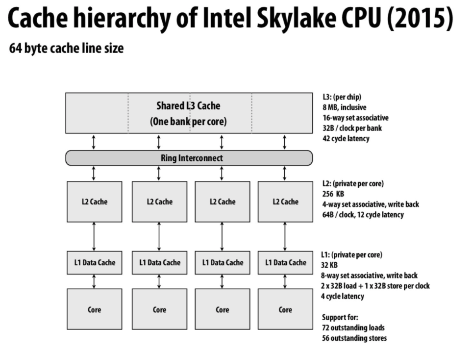
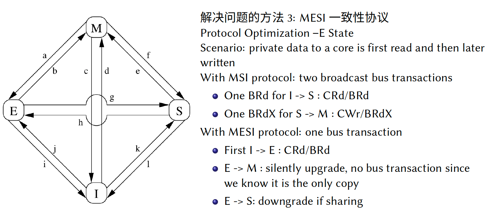

# Lecture 20: Multicore

## Introduction

1. Widely used in industry

   - Intel / AMD / IBM / ARM / RISC-V
   - Frequency increasing slow down => multicore arise!

   

   - CPU performance increases are slowing

     

   ​	

2. CMP VS SMP
   

   - Separate => SMP

     - No shared cache

     - Each cache has bus to connect to memory

     - CPU inter-connect

       

   - Shared => CMP

     - Share L2 cache
     - One CPU => many cores
     - CPU intra-connect

3. NUMA architecture

   

   - Each node can SMP architecture
   - Each core access memory with different latency.. => Non uniform memory access
   - CPU interconnect with other CPUs..

   

4. Comparison
   

   - All share-memory
   - But **may with different latency**..
   - Memory hierarchy comes to help!

   - In NUMA => 0-hop, 1-hop, 2-hop (different latency) (4x difference)

5. How to make OS better for multicore + NUMA platform?
   

   - **Can traditional abstraction scales to multiple processors**?

   32Core + 4NUMA
   

   - In one core => Linux is the best
   - Solaris => scales well ..
   - Time = user time + system time + idle time

6. Different benchmark
   

   - 操作系统中保护**共享数据结构**的**同步原语**是影响可扩展性的重要因素
   - **锁竞争**可能导致可扩展性随着核数的增加而下降(**锁颠簸**现象)

7. What’s scalability?
   Amdahl’s law
   

   

   - Practical curve => **sync cost >> parallel speedup**

8. Locking / mutex / synchronization

   

   Various types of synchronization techniques used by the Linux
   

   

## Cache coherence

### What’s cache coherence?

1. Cache

   - Write back / write through
   - Write allocate / Write non-allocate

   

   

2. Baseline system model
   

   

   - DMA => no cache !

3. **Hardware-based cache coherence**
   - Provide **a consistent view of memory across the machine**.
   - Read will **get the result of the last write to the memory hierarchy**
4. A real CPU
   
   - n outstanding loads (stores): **ability to track n loads (stores) at the same time**, but it doesn't mean it happens in 1 cycle
5. Example of incoherence
   

   Define of coherence
   

   如果一个CPU 缓存了某块内存，那么在其他CPU 修改这块内存的时候，我们希望得到通知。**我们拥有多组缓存的时候，真的需要它们保持同步**。或者说，系统的内存在各个CPU 之间无法做到与生俱来的同步，我们实际上是需要一个大家都能遵守的方法来达到同步的目的

   

	Naive Solution: Share one cache
   
   

## Intuition of shared memory

1. Intuitive expectation of shared memory
   

   - The reason why DMA is an exception in uniprocessor is that **DMA will access memory via bus ignoring the value in cache**.

   - Coherence is an issue even in a single CPU system
     
     - Cache coherence will be a problem **when different components connected to the memory hierarchy have different perceptions of what memory is at some certain time. A processor will include cache data in its perception of memory, an I/O device using DMA will not.** 

2. Problems with this intuition

   
   
3. Definition of coherence
   

   - We want a coherence view !
   - Another definition => coherence (said differently)
     
   - **Sufficiently separated**
     - **it depends on the coherence implementation used**, so "sufficiently separated" should mean long enough for P2's cache to communicate the fact that there was a write to P1's cache. If P1 reads before that information is communicated, then **the system is still coherent as long as all processors "observe" the same order**

4. Write serialization
   

   - In distributed systems, these consistency issues are very common as well, but in those situations they are solved by majority vote algorithms, such as Paxos. **In this case however, we will not be to use such algorithms because the overhead of having processors communicate P2P will be very high, and we would rather use the interconnect**.

5. Implementing cache coherence
   

   - **Not uncachable, but rather as paged out**. Like you said, this will trigger a page fault and the OS can intervene and issue the appropriate network communication to execute the access.

6. Snooping cache coherence mechanisms
   

7. The cache coherence logic

   - Each processor’s cache controller in response to
     - Loads and stores by the local processor
     - Message it receives from other caches
   - Cache coherence with write back caches
     

### MSI / MESI

1. Solution2: MSI
   

   

   - Snoop => bus
   - Directory => NUMA
   - Reduce invalidate number ! 

   - MSI write back invalidation protocol
     
   
     
   
   - Summary of MSI
     
   
   - MSI satisfies coherence
     
   
2. MSEI protocol
   

   MESI state transition diagram

   

   
   

   - MSI : read + write => two transactions
   
- MSEI: read + write => one transaction
   
- Each cache in the following states
     

   - Clear explanation
  
   
  
   

   

   

   

   
   
   
   
   
   
   
   

- We need to insert `memory barrier` instruction..

### More advanced protocol

1. Low level choices
   
2. Increasing efficiency
   

### Update based coherence

1. Difference between invalidation based protocol
   
   - The basic idea of update-based protocols is to **give everybody else the latest value**, so that **they don't need to reload them from main memory**, which is different from invalidation-based protocols.
2. Dragon write back update protocol
   
3. State transition diagram
   
4. Invalidate VS. Update based protocols
   
   - Update based protocols tend to **occupy much higher bandwidth** than invalidate protocols.
5. 
   - **Update is not necessarily better**. **It looks like it is better because updating makes sure there aren't as many misses**, since the most recent data is in the cache. But, in update the cache will always want to be full, which leads to updates having to be communicated across the processors, **which can be expensive**.
6. Compare traffic
   
   - Consider following two scenarios as bad for **update-based** protocol
     - **The updated value is never read again from the various processors whose cache lines were updated**.
     - **There are a lot of subsequent updates before the other processors read from the cache line**.

### Back to reality

1. Multi-level cache hierarchies
   

   - **A multilevel cache hierarchy is a powerful tool to keep important/commonly accessed data close to the core using it**, however it can cause problems and increase overhead when it comes to maintaining cache coherence.

2. Inclusion property
   

   

3. Maintaining inclusion: **handling invalidations**
   

   Maintaining inclusion: **L1 write hit**
   

4. HW implications of implementing coherence
   

5. NVIDIA GPUs don’t implement cache coherence
   

### Implication of cache coherence to the programmer

1. Artificial communication via false sharing
   

   - **The second version is better because it reduces false sharing between threads because each thread will now have a counter on its own cache line**. In the top version many of the counters share the same cache line so when a thread updates its counter the invalidation of that line must be broadcast to all other threads and they must then get the updated data before making their own changes.
   - And I think in order to avoid false sharing and at the same time exploit the benefit of locality, we need to put contents that will be sequentially accessed by one thread on the same cache line while putting contents that will be accessed by different threads on separate cache lines.

2. Demo false sharing
   

   False sharing explain
   

3. Impact of cache line size on missing rate
   

   

4. Summary snooping-based coherence
   

### Directory based coherence

1. Directory based coherence
   

   

7. **Hardware-based cache coherence**
   - Provide **a consistent view of memory across the machine**.
   - Read will **get the result of the last write to the memory hierarchy**
8. A real CPU
   
   
   - n outstanding loads (stores): **ability to track n loads (stores) at the same time**, but it doesn't mean it happens in 1 cycle

## Reference

1. [An interesting cache coherence simulator](https://github.com/srikantaggarwal/Cache-Coherence)

   

