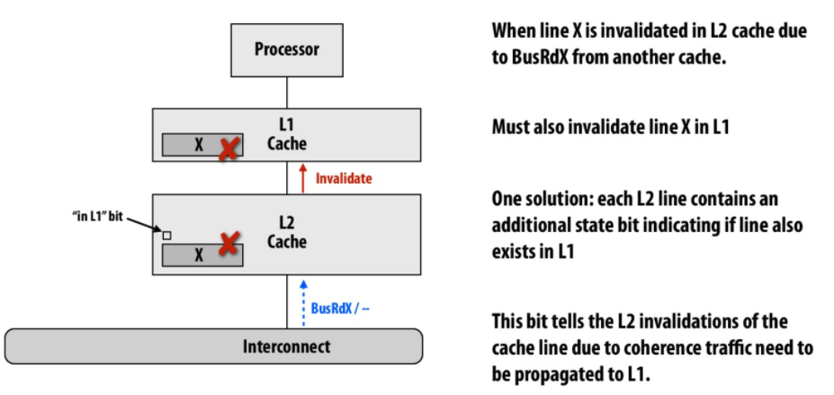
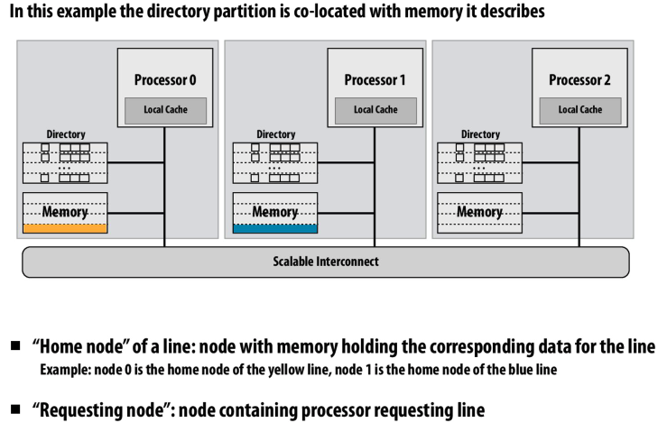
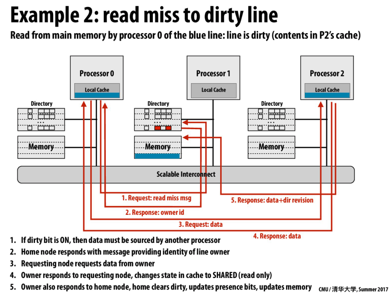
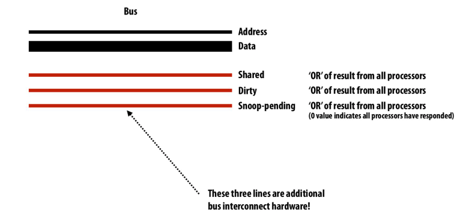
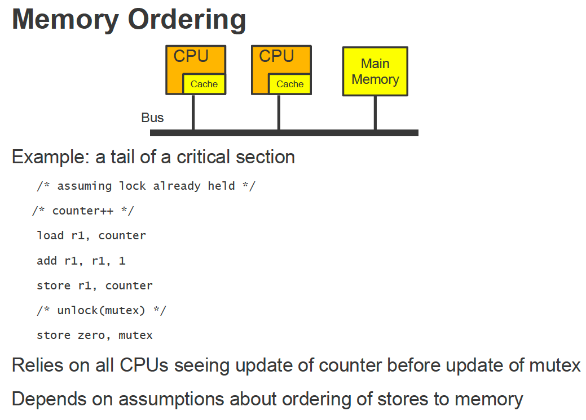
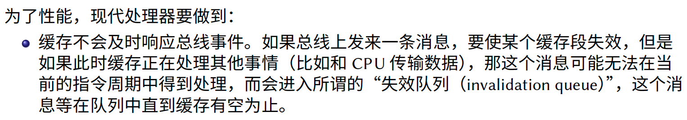
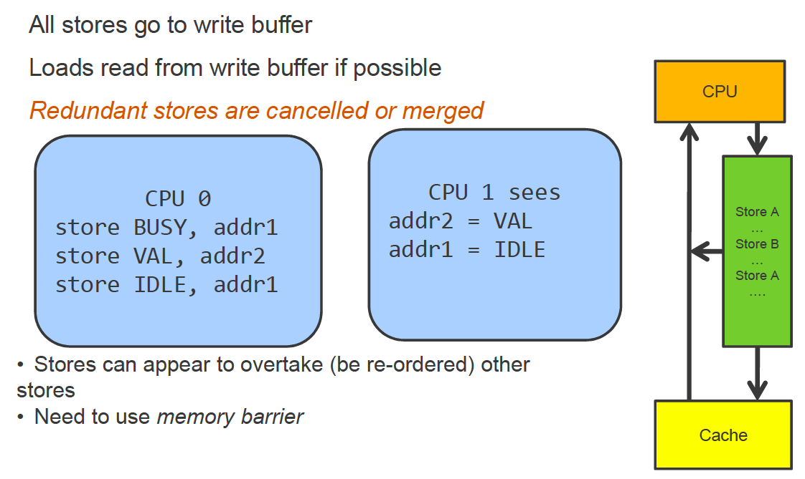
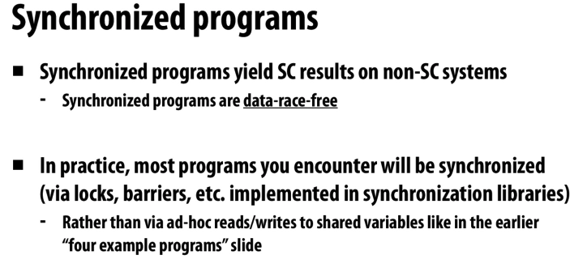
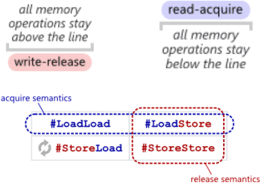

# Lecture 20: Multicore

## Introduction

1. Widely used in industry

   - Intel / AMD / IBM / ARM / RISC-V
   - Frequency increasing slow down => multicore arise!

   

   - CPU performance increases are slowing

     

   ​	

2. CMP VS SMP
   

   - Separate => SMP

     - No shared cache

     - Each cache has bus to connect to memory

     - CPU inter-connect

       

   - Shared => CMP

     - Share L2 cache
     - One CPU => many cores
     - CPU intra-connect

3. NUMA architecture

   

   - Each node can be SMP architecture
   - Each core access memory with different latency.. => Non uniform memory access
   - CPU interconnect with other CPUs..

   

4. Comparison
   

   - All share-memory
   - But **may with different latency**..
   - Memory hierarchy comes to help!

   - In NUMA => 0-hop, 1-hop, 2-hop (different latency) (4x difference)

5. How to make OS better for multicore + NUMA platform?
   

   - **Can traditional abstraction scales to multiple processors**?

   32Core + 4NUMA
   

   - In one core => Linux is the best
   - Solaris => scales well ..
   - Time = user time + system time + idle time

6. Different benchmark
   

   - 操作系统中保护**共享数据结构**的**同步原语**是影响可扩展性的重要因素
   - **锁竞争**可能导致可扩展性随着核数的增加而下降(**锁颠簸**现象)

7. What’s scalability?
   Amdahl’s law
   

   

   - Practical curve => **sync cost >> parallel speedup**


8. Locking / mutex / synchronization

   

   Various types of synchronization techniques used by the Linux
   

   

## Cache coherence

### What’s cache coherence?

1. Cache

   - Write back / write through
   - Write allocate / Write non-allocate

   

   

2. Baseline system model
   

   

   - DMA => no cache !

3. **Hardware-based cache coherence**
   - Provide **a consistent view of memory across the machine**.
   - Read will **get the result of the last write to the memory hierarchy**
4. A real CPU
   
   
   - n outstanding loads (stores): **ability to track n loads (stores) at the same time**, but it doesn't mean it happens in 1 cycle
5. Example of incoherence
   

   Define of coherence
   

   如果一个CPU 缓存了某块内存，那么在其他CPU 修改这块内存的时候，我们希望得到通知。**我们拥有多组缓存的时候，真的需要它们保持同步**。或者说，系统的内存在各个CPU 之间无法做到与生俱来的同步，我们实际上是需要一个大家都能遵守的方法来达到同步的目的

   

	Naive Solution: Share one cache
   
   

## Intuition of shared memory

1. Intuitive expectation of shared memory
   

   - The reason why DMA is an exception in uniprocessor is that **DMA will access memory via bus ignoring the value in cache**.

   - Coherence is an issue even in a single CPU system
     
     - Cache coherence will be a problem **when different components connected to the memory hierarchy have different perceptions of what memory is at some certain time. A processor will include cache data in its perception of memory, an I/O device using DMA will not.** 

2. Problems with this intuition

   
   
3. Definition of coherence
   

   - We want a coherence view !
   - Another definition => coherence (said differently)
     
   - **Sufficiently separated**
     - **it depends on the coherence implementation used**, so "sufficiently separated" should mean long enough for P2's cache to communicate the fact that there was a write to P1's cache. If P1 reads before that information is communicated, then **the system is still coherent as long as all processors "observe" the same order**

4. Write serialization
   

   - In distributed systems, these consistency issues are very common as well, but in those situations they are solved by majority vote algorithms, such as Paxos. **In this case however, we will not be to use such algorithms because the overhead of having processors communicate P2P will be very high, and we would rather use the interconnect**.

5. Implementing cache coherence
   

   - **Not uncachable, but rather as paged out**. Like you said, this will trigger a page fault and the OS can intervene and issue the appropriate network communication to execute the access.

6. Snooping cache coherence mechanisms
   

7. The cache coherence logic

   - Each processor’s cache controller in response to
     - Loads and stores by the local processor
     - Message it receives from other caches
   - Cache coherence with write back caches
     

### MSI / MESI

1. Solution2: MSI
   

   

   - Snoop => bus
   - Directory => NUMA
   - Reduce invalidate number ! 

   - MSI write back invalidation protocol
     
   
     
   
   - Summary of MSI
     
   
   - MSI satisfies coherence
     
   
2. MSEI protocol
   

   MESI state transition diagram

   

   
   

   - MSI : read + write => two transactions
   
- MSEI: read + write => one transaction
  
- Each cache in the following states
     

   - Clear explanation
  
  
  
  


   

   

   

   


- We need to insert `memory barrier` instruction..

### More advanced protocol

1. Low level choices
   
2. Increasing efficiency
   

### Update based coherence

1. Difference between invalidation based protocol
   
   - The basic idea of update-based protocols is to **give everybody else the latest value**, so that **they don't need to reload them from main memory**, which is different from invalidation-based protocols.
2. Dragon write back update protocol
   
3. State transition diagram
   
4. Invalidate VS. Update based protocols
   
   - Update based protocols tend to **occupy much higher bandwidth** than invalidate protocols.
5. 
   - **Update is not necessarily better**. **It looks like it is better because updating makes sure there aren't as many misses**, since the most recent data is in the cache. But, in update the cache will always want to be full, which leads to updates having to be communicated across the processors, **which can be expensive**.
6. Compare traffic
   
   - Consider following two scenarios as bad for **update-based** protocol
     - **The updated value is never read again from the various processors whose cache lines were updated**.
     - **There are a lot of subsequent updates before the other processors read from the cache line**.

### Back to reality

1. Multi-level cache hierarchies
   

   - **A multilevel cache hierarchy is a powerful tool to keep important/commonly accessed data close to the core using it**, however it can cause problems and increase overhead when it comes to maintaining cache coherence.

2. Inclusion property
   

   

3. Maintaining inclusion: **handling invalidations**
   

   Maintaining inclusion: **L1 write hit**
   

4. HW implications of implementing coherence
   

5. NVIDIA GPUs don’t implement cache coherence
   

### Implication of cache coherence to the programmer

1. Artificial communication via false sharing
   

   - **The second version is better because it reduces false sharing between threads because each thread will now have a counter on its own cache line**. In the top version many of the counters share the same cache line so **when a thread updates its counter the invalidation of that line must be broadcast to all other threads** and they must then get the updated data before making their own changes.
   - And I think in order to avoid false sharing and at the same time exploit the benefit of locality, we need to put contents that will be sequentially accessed by one thread on the same cache line while putting contents that will be accessed by different threads on separate cache lines.

2. Demo false sharing
   

   False sharing explain
   

3. Impact of cache line size on missing rate
   

   

4. Summary snooping-based coherence
   

### Directory based coherence

1. Problems we need to consider
  
- What limits the scalability of snooping-based cache coherence protocols?
     - **All processors/caches much communicate via the interconnect**. The interconnect traffic limits the scalability of snooping based approaches.
- How a directory based scheme avoid this problem?
   - How can the storage overhead of directory structure be reduced?
     - limited pointer schemes
     - sparse directories
   
2. One naive solution
   

   

   

3. Problem: scaling cache coherence to large machines
   

4. NUMA systems nowadays are normal

   - Multi-socket intel systems
     
   - Intel’s ring interconnect (on one chip)
     

5. Scalable cache coherence using directories
   

   - **Directory-based vs. snooping-based cache coherence is an instance of the space-time tradeoff**. By designating directory to cache lines, directory-based coherence uses additional space to avoid the inefficient broadcasting and high latency.

6. Implementing cache coherence on share-bus
   

7. A very simple directory
   

8. A distributed directory
   

   

   

   

9. Advantages of directories
   

10. Cache invalidation patterns
   

   In general, only a few shared during a write
   

11. Directory based coherence
    

    

1. How big is the directory?
   

   Full-bit vector representation
   

#### Reducing storage overhead of directory

1. Full-bid vector => huge storage overhead
   

   - Increase cache line size => painful false sharing

2. Limited pointer schemes
   

   Managing overflow of limited pointer scheme
   

   Optimize for the common case
   

   - This slide illustrates a key idea in Systems programming: **your solution should not be driven by its theoretical properties but rather by an careful analysis of the workload of the system**. Following the same idea, one should always **try to keep his implementations simple when a complex scheme doesn't bring extra performance**.

3. Sparse directories
   

   

    - Why doubly linked list?
      	- Node deletion in doubly linked list only takes O(1).
      	- On write, invalidation needs to be propagated to both directions.
   - Scaling properties
     

   Recall: write miss in full bit vector scheme
   

4. Optimizing directory based coherence
   
   - Limited pointer schemes take advantage of the fact that the data is probably only in a few caches at once.
   - Sparse directories take advantage of the fact that most of memory is not resident in the cache, and the coherence protocol only needs to worry about sharing information for lines that are currently in cache.

5. Recall: read miss to dirty line
   

6. Intervention forwarding
   

   

   		- In the normal directory based protocol, the home node responds to the requesting node with the owner's id. The requesting node then requests the data from the owner, which sends the data to both the home node and the requesting node. In the intervention forwarding optimization, however, the home node acts as a middleman by requesting data from the owner node, getting the response, and sending the response back to the requesting node.

7. Request forwarding
   

8. Intel core i7 CPU
   

   - Only L3 cache and inclusion properties
   - Ring connection

9. Coherence in multi-socket intel systems
   

10. Xeon Phi
    

    

    

    

11. Summary: directory based coherency
    


### A real CPU

2. **Hardware-based cache coherence**
   - Provide **a consistent view of memory across the machine**.
   - Read will **get the result of the last write to the memory hierarchy**
3. A real CPU
   
   - n outstanding loads (stores): **ability to track n loads (stores) at the same time**, but it doesn't mean it happens in 1 cycle

## A Basic Snooping-Based Multi-Processor Implementation

1. Different between cache coherence protocols and implementation
   - Cache coherence protocol
     - What messages / transactions needed to be sent
     - Messages / transactions were atomic
2. The goals of our coherence implementation
   - Be **correct**
   - Achieve **high performance**
   - **Minimize cost** (minimize amount of extra hardware needed to implement coherence)

3. What we should know?
   

   - An interconnect is the network connecting a number of clients in a parallel machine (**processors**, **caches**, **memories**)
   - A bus is **a particular type of interconnect**

   - Deadlock, livelock => program correctness

     - Required conditions for deadlock
       

     - Livelock
       
     - A difference between livelock and deadlock
       - A live lock is different from a dead lock in that, in a dead lock, everyone is simply waiting and no one is doing anything; in a live lock, at least some one is doing something, but the whole system is not making program.

   - Starvation => an issue of fairness

     - Starvation
       

### A basic implementation of snooping (assuming an atomic bus)

1. Consider a basic system design
   

   - **An atomic bus allows only one channel at a time to send a message**, but everyone connected to the bus can see the message.

2. Transactions on an atomic bus
   

   - With this definition of an atomic bus, the "atom" includes the client who is granted access placing its command and data on the bus **and** other clients placing their responses on the bus. Within this atom the bus is "locked" to any other bus transaction.

3. Cache miss logic on a uniprocessor
   

4. Multi-processor cache controller behavior
   

   

5. Reporting snoop results
   

   Reporting snoop results: how
   
   Reporting snoop results: when
   

6. Handling write back of dirty cache lines
   

7. Cache with write-back buffer
   

8. In practice state transitions are not atomic
   

   - An example of race condition
     

   - Fetch deadlock
     
   - Livelock
     

9. Reminder: memory coherence
   

10. Self check: when does a write commit?
    

    - write-back buffer doesn't effect time of commit, this is because all processors will check the value in the write-back buffer before they check the memory, so if a processor successfully get to M state then modify a cache line, it will always be observed by other processors.

11. Starvation
    

12. Design issues
    

13. First-half summary
    

### Building the system around non-atomic bus transactions

1. An atomic bus system creates a bottleneck in bus arbitration
   

   - An atomic bus system creates a bottleneck in bus arbitration. In that any request a processor makes will probably have some time before it is served in which nothing else is able to be done on the bus. Since the bus is used by all processors and is a valuable resource, this is **wasting a lot of important time**.

2. Review: transaction on an atomic  bus
   

3. Split transaction bus
   

   - The atomic bus acted as a bottleneck. So we want to be able to perform operations in between the request and response. This allows room for race conditions however. Since the atomic bus bottlenecked the timeline, it forced a serial ordering on the operations.

4. New issues arise due to split transactions
   

5. A basic design
   

6. Initiating a request
   

7. Read miss: cycle-by-cycle bus behavior
   
   

   

8. Pipelined transactions
   

   

9. Key issues to resolve
   

   

   

10. Why do we have queues in a parallel system
    

11. Multi-level cache hierarchies
    

    Recall the fetch-deadlock problem
    

    

    

    

12. 

## Memory Consistency

### Introduction

1. Cache
   

   Memory Consistency Model
   

2. Coherence concerns accesses only a **single memory location**

   - Making sure that caches & **stale copies** do not cause problems
   - Two invariants: **single-writer multiple-readers**, **data-value**

   Consistency concerns ordering for **accesses to many locations**

   - Making sure that ordering does not cause problems

   Comparison
   

   

   

3. Why we need cache coherence and why relaxed memory consistency?
   

   - Aggressive memory operation ordering
     
   - 

4. Synchronization
   

   Atomic instructions
   

   - Test & Set algorithm
     

   Improving performance of Sync
   

5. An example of memory ordering
   

   - Seeing update of counter before update of mutex ..

6. Memory consistency model
   

7. Sequential Consistency
   

   Define the notion of order
   

   Last in memory order
   

8. Sequential Consistency affects performance ...
   

   

   

   

   

   Realistic Memory Consistency Mode: modern hardware features can interfere with store order

   - **write buffer** (or store buffer or write-behind buffer)
     
     - Total order storing: Stores are guaranteed to **occur in FIFO order**
     - Effect of write buffer: sometimes load **appears ** bypass store
       
   - **instruction reordering** (out-of-order execution)
   - **superscalar execution** and pipelining

   Each CPU/core keeps its own execution consistent, but how is it viewed by others?

9. Total Store Order Consistency
   

   - Fence <-> memory barrier
     
   - Atomic operations ..
     

10. QUIZ
    

    - Fence => S1 before L1 and S2 before L2 ...

11. TSO implementation
    

12. Partial store ordering (ARM)
    

    

13. Memory Fence

    - Example
      

    Acquire and release semantics
    

    C++11 Atomic T
    

    

14. Conflicting data access
    

    

    Relaxed consistency
    

    Parallel Technique
    
    

    

15. Even more relaxed ..
    

16. Memory consistency hardware takeaway
    

    

17. Some locks

    - Spinlock
      

      Spinning versus switching
      

      

    - Interrupt Disabling
      

    - Alternative to spinning

      - Conditional Lock (tryLock)
        

      - Limited time lock
        

      - Common multiprocessor spin lock
        

      - Compare two simple spinlocks

        ```c++
        // Test and Set
        void lock (volatile lock_t *l) {
        while (test_and_set(l)) ;
        }
        // Test and Test and Set
        void lock (volatile lock_t *l) {
        while (*l == BUSY || test_and_set(l)) ;
        }
        ```

        - The second lock
          - Avoid bus traffic contention caused by test_and_set until it is likely to succeed
          - Normal read spins in cache 
        - Benchmark results
          

    - MCS locks
      

      


## Back to the real world

1. Ways to achieve synchronize with
   

2. Real hardware & Compiler

   - Real hardware doesn’t run the code that you wrote.
   - Real compiler doesn’t produce the code that you wrote.

   

   Weak & Strong
   

   In TSO, both 0 is valid
   

   The problem of data race
   

   

   - Read between the 2 write 16 bits ...

## C++11 Memory Model

1. History
   

2. Why C++11 Memory Model
   

3. Happens before

   - An important **fundamental concept** in understanding the memory model

   - A guarantee that memory writes by **one specific statement are visible to another specific statement**

   - Use memory fence to ensure this order

     ```c++
     int A, B;
     void foo()
     {
     	A = B + 1;
     	asm volatile("" ::: "memory");
     	B = 0;
     }
     ```

   - Atomic

     ```c++
     //x86
     #define COMPILER_BARRIER() asm volatile("" ::: "memory")
     //PowerPC
     #define RELEASE_FENCE() asm volatile("lwsync" ::: "memory")
     ==============================================
     int Value;
     std::atomic<int> IsPublished(0);
     void sendValue(int x)
     {
       Value = x;
       // <-- reordering is prevented here!
       IsPublished.store(1, std::memory_order_release);
     }
     ```

     

     

4. `std::memory_order`
   

   - `std::memory_order_seq_cst`
     

     

   

   - `std :: memory_order_release/acquire`

     - Release store & Acquire load
       

       

     - Acquire semantic
       

     - Release semantic
       

     

     On different architecture
     

     

5. `std::memory_order_consume`

   - Data dependency ordering
     

     

     

   - On different architecture
     

     

     

     

   - Real world: RCU
     

6. `std::memory_order_relaxed`

   

## Lock Free Programming

1. What’s lock free programming
   

2. Some details
   

3. Lock Free Stack

   ```
   template<typename T>
   class lock_free_stack
   {
   private:
     struct node
     {
       T data;
       node* next;
       node(T const& data_): // 1
       data(data_)
       {}
     };
     std::atomic<node*> head;
     public:
     void push(T const& data)
     {
       node* const new_node=new node(data); // 2
       new_node->next=head.load(); // 3
       while(!head.compare_exchange_weak(new_node->next,new_node)); // 4
     }
     void pop(T& result)
     {
       node* old_head=head.load();
       while(!head.compare_exchange_weak(old_head,old_head->next));
       result=old_head->data;
     }
   }
   ```

   

## Reference

1. [An interesting cache coherence simulator](https://github.com/srikantaggarwal/Cache-Coherence)

   

