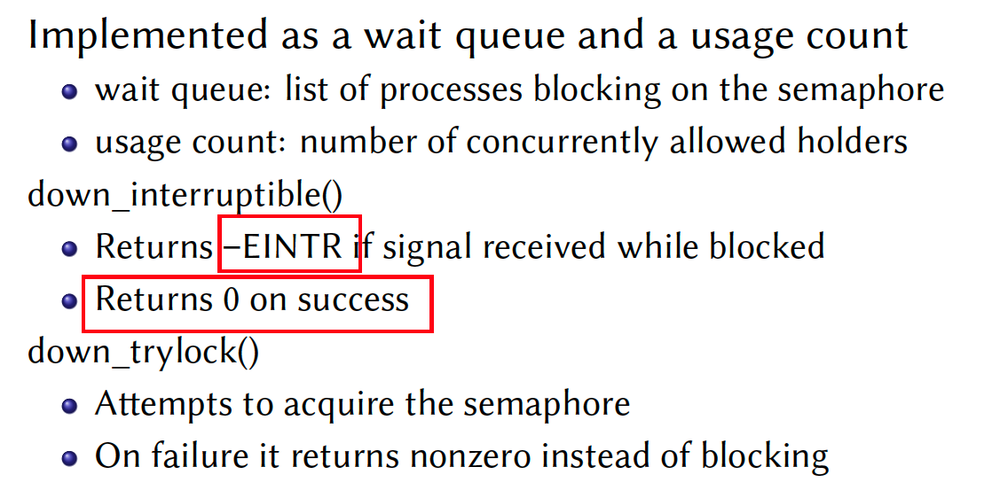
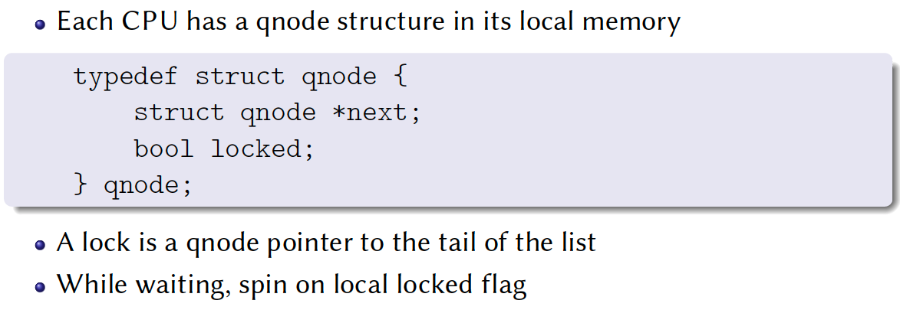

# Lecture 21: Concurrency in OS kernel

## Introduction

1. Locking in the **Linux Kernel**
   - Why do we need locking in the kernel?
   - Which problems are we trying to solve?
   - What implementation choices do we have?
   - Is there a one-size-fits-all solution?
2. **Concurrency in Linux**
   - Linux is a **symmetric multiprocessing** (SMP) preemptible kernel
   - Its has true concurrency
   - And various forms of **pseudo concurrency**

### Pseudo Concurrency in Linux

1. Software based preemption
   

2. Hardware preemption
   

3. The following assertion is all valid in Uniprocessor world

   ```
   // prog1
   preempt disable;
   	r1 = x;
   	r2 = x;
   preempt enable;
   assert (r1 == r2)
   
   // prog2
   preempt disable;
   	r1 = x;
   	yield();
   	r2 = x;
   preempt enable;
   assert (r1 == r2)
   
   // prog3
   interrupt disable;
   	r1 = x;
   	r2 = x;
   interrupt enable;
   assert (r1 == r2)
   ```

   - Notice: **interrupt disable** is even stricter than **preempt disable**

### True Concurrency in Linux

1. What’s true concurrency?
   

2. Following assertion is not valid in **Multiprocessor** world

   ```
   interrupt disable;
   	r1 = x;
   	r2 = x;
   interrupt enable;
   assert (r1 == r2)
   ```

3. Atomic operators in Linux
   

4. Spin locks in Linux

   - Spin lock
     

   - Basic use of spinlock
     

   - Spinlocks and interrupts
     

   - Solution to Spinlocks and interrupts
     

   - Spinlocks & Interrupt disabling
     

   - Bottom Halves and Softirqs
     

     

   - Rules
     - Do not try to re-acquire a spin lock you already have
     - Spinlocks shouldn’t be held for a long time
     - Do not sleep while holding spin locks

5. Semaphores

   - What is Semaphore?
     

   - Implementation
     

     

6. Reader-Writer Locks

   - Why differentiate reader and writer?
     - No need to synchronize concurrent readers unless a writer is present
     - Both spin locks and semaphores have reader/writer variants

## Scalable lock

### Ticket spinlock

1. Goal

   - **Correctness**: Mutual exclusion, Progress, Bounded wait
   - **Fairness**
   - **Performance**

2. Idea

   - Reserve each thread’s turn to use a lock
   - Each thread spins until their turn
   - Use new atomic primitive: fetch-and-add (FAA)
   - Spin while not thread’s != turn
   - Release: Advance to next turn

   ```
   typedef struct {
   	int ticket;
   	int turn;
   } lock_t;
   void lock_init(lock_t *lock) {
   	lock->ticket = 0;
   	lock->turn = 0;
   }
   void acquire(lock_t *lock) {
     int myturn = FAA(&lock->ticket);
     while (lock->turn != myturn); // spin
   }
   void release(lock_t *lock) { lock->turn += 1; }
   ```

3. Analysis of ticket spinlock
   

   

### MCS lock

1. Spin on different cache line

   - Goal: O(1) message release time
   - Can we wake just one core at a time?
   - Idea: Have each core spin on a different cache-line

2. MCS lock
   

   

   - Acquiring MCS locks

     ```c++
     acquire (qnode *L, qnode *I) {
       I->next = NULL;
       qnode *predecessor = I;
       XCHG (*L, predecessor);
       if (predecessor != NULL) {
         I->locked = true;
         predecessor->next = I;
         while (I->locked) ;
       }
     }
     ```

   - Releasing MCS locks

     ```c++
     release (lock *L, qnode *I) {
     	if (!I->next)
     		if (CAS (*L, I, NULL))
     			return;
       while (!I->next) ;
       I->next->locked = false;
     }
     ```

     

3. Compare Ticket lock and MCS lock

   

   - When the number of cores is low and the critical region is small, the MCS lock complex acquiring and releasing logic cost a lot of time. 

### CLH lock

1. An illustrated diagram
   

2. CLH lock

   ```c++
   type qnode = record
     prev : ^qnode
     succ_must_wait : Boolean
   
   type lock = ^qnode // initialized to point to an unowned qnode
   
   procedure acquire_lock (L : ^lock, I : ^qnode)
     I->succ_must_wait := true
     pred : ^qnode := I->prev := fetch_and_store(L, I)
     repeat while pred->succ_must_wait
   
   procedure release_lock (ref I : ^qnode)
     pred : ^qnode := I->prev
     I->succ_must_wait := false
     I := pred // take pred's qnode
   ```

3. Waiting on previous one variable on different CPU. 
   - Suitable for SMP architecture
   - But a disaster for NUMA

### Comparison

1. Locking strategy comparison
   


