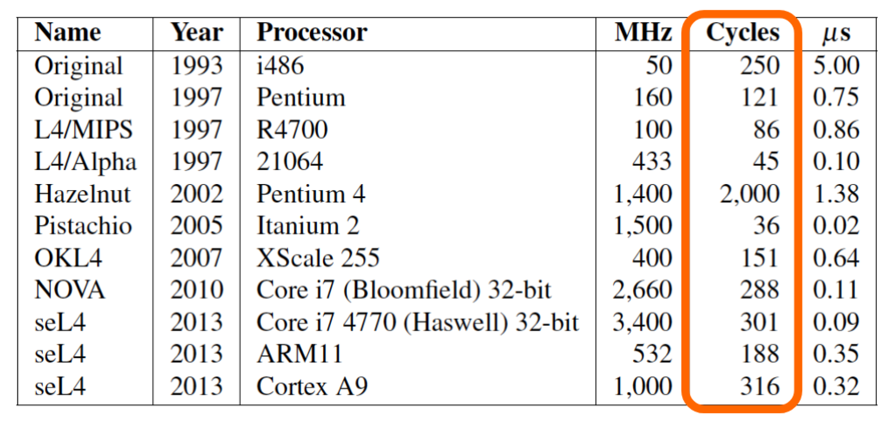

# 3. Micro Kernel

## What is a Microkernel?

1. Micro kernel

   - Kernel with minimal features (IPC, interrupt …)
   - Memory management process is like a **server** which handle memory management request.
   - **Move as much from the kernel into user space**
     - Address spaces are different
     - Use IPC to communicate 
     - Scheduling is frequent

   

2. Pros and Cons

   - Pros
     - Flexibility
       - Implement kernel function in **user space**
     - Safety
       - User process has **protection method** (using virtual memory) 
     - Modularity
       - From Software Engineering perspective
   - Cons
     - **Address spaces**
       - Driver and server and kernel are in **different** user space
     - **IPC**
       - **Huge** IPC overhead
     - **Scheduling**
       - **Frequent** scheduling

   

   

4. Good design but **bad performance**

## Microkernel - Mach

1. Mach kernel
   

   - Can support various kinds of **OS Application** and **database**
     - Provide similar interface like different OS
   - Different threads have different **ports**
   - Memory object concept
     - **More flexible**
     - **Memory object** -> we can transfer memory from one process to another process
     - **Hierarchical pagers**

   

2. Performance problem with `Mach`

   - the use of IPC for almost all tasks turned out to have serious performance impact.
   - **system calls take 5-6X** as long as UNIX
   - given a `syscall` that does nothing, a full round-trip under BSD would require about 40μs, whereas on **a user-space Mach system it would take just under 500μs**.
   - benchmarks on 1997 hardware showed that Mach 3.0-based UNIX single-server implementations were about **50% slower than native UNIX**.

## Microkernel - L4

1. Second generation microkernel - L4 by Jochen Liedtke (GMD)

   - Target for **embedding system**, not **general system**

   - Performance

     - **synchronous IPCs** -> async IPCs (like `epoll` in Linux)
       - Reduce scheduling frequency
     - Smaller, Mach 3 (330 KB) -> L4 (12 KB)
     - **IPC security checks moved to user process**
       - Better for performance
     - IPC is **hardware dependent**
       - Wrote in assembly

     

2. L4 family
   

   One-way IPC cost over years
   

   Sources lines of code
   

   - Because driver is not in the kernel (microkernel design). `75%` code of Linux kernel are driver program.  
   - Now totally target for **embedding system**
   - **Micro kernel is good for scalability** ( better in distributed system and network system)

## Reference

1. [THU AOS](https://github.com/chyyuu/aos_course_info)

