# 4. File System General

## File System Basic

The process -> a virtualization of CPU

The address space -> a virtualization of memory

The file system -> a virtualization of persistent storage

- Hard disk drive
- Solid-state storage device

Two abstractions

- File 
  - Associated with **inode number**
- Directory
  - Associate with **inode number**
  - Contains a list of pairs (user-readable name, low-level name)

In UNIX systems, the file system provides **a unified way** to access file or disk and many other devices.

Actually **inode** contains file metadata!

File system tree

- Ext3: a standard disk-based file system
- Proc: a file system for accessing information about current processes
- Tmpfs: a file system just for temporary files
- AFS: a distributed file system

### The big picture of file system

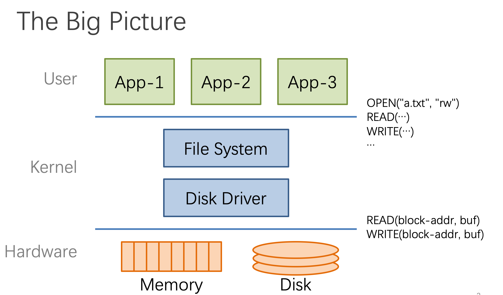

### Abstraction: API of UNIX file system

- Open, read, write, seek, close
- fsync [link](http://man7.org/linux/man-pages/man2/fdatasync.2.html)
- Stat, Chmod, Chown 
- Rename, link, unlink, symlink
- Mkdir, Chdir, Chroot ([link](https://www.howtogeek.com/441534/how-to-use-the-chroot-command-on-linux/))
- Mount, unmount

### Inode structure

- block
- Direct block
- Indirect block

### At the head of Disk Partition

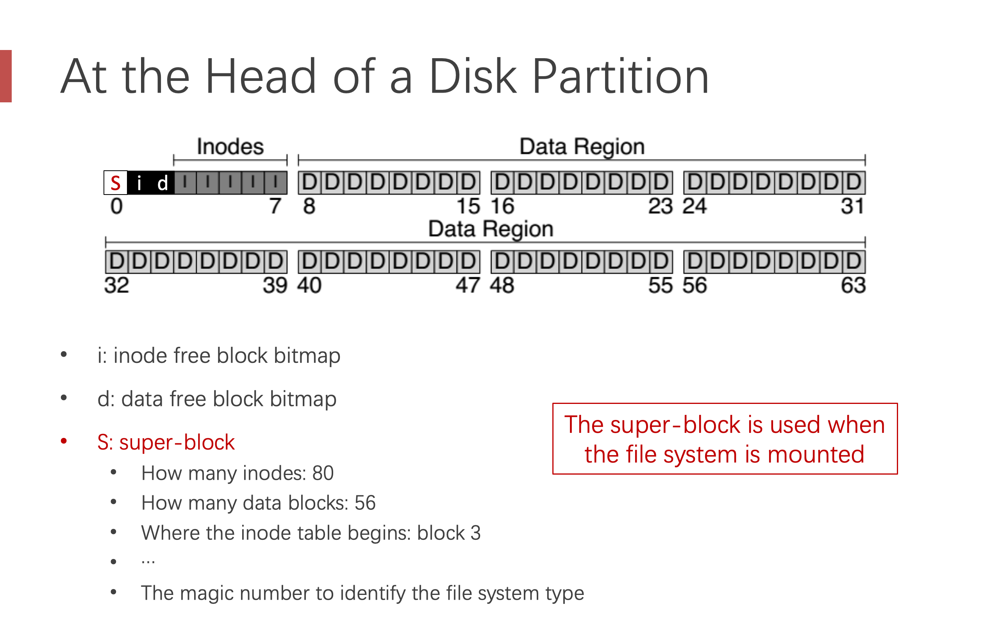

### Directly Dump a Directory

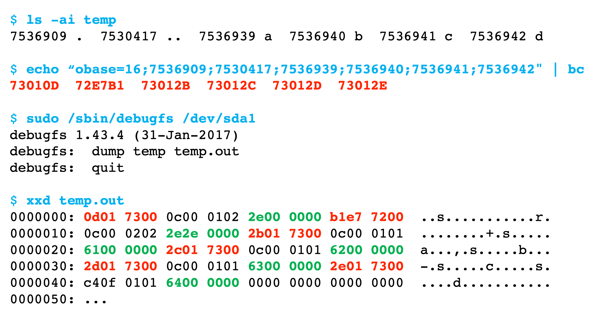

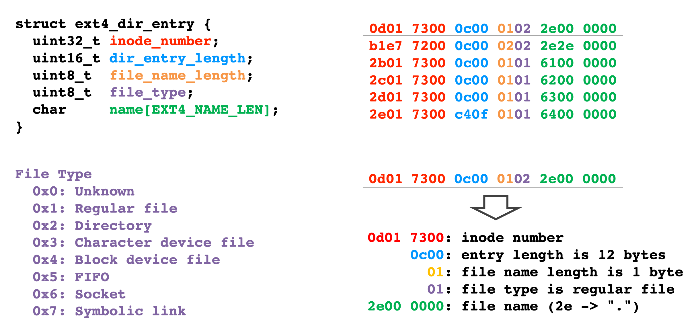

### Two Types of Links

Hard link

- No new file created
- Just add a binding between a string and an existing `inode`
- Target `inode` reference count is increased
- If target file is deleted. The link is still valid
- Limits
  - You can’t hard link to files in other data partitions
  - You can’t create one hard link to a directory

Soft link

- A new file is created, the data will be the same as original file
- Target `inode` reference count is not increased
- If target file is deleted, the link is not valid
- The referred pathname determines the size of the symbolic link

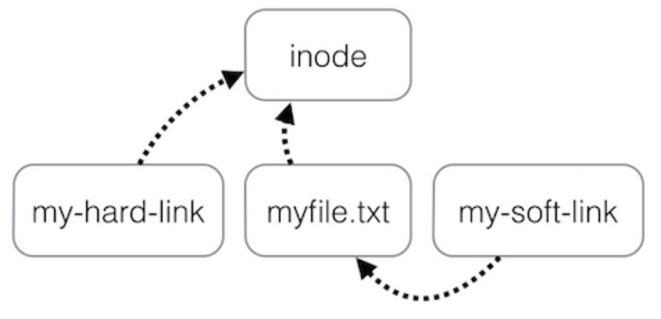

### Directly dump a symbolic link

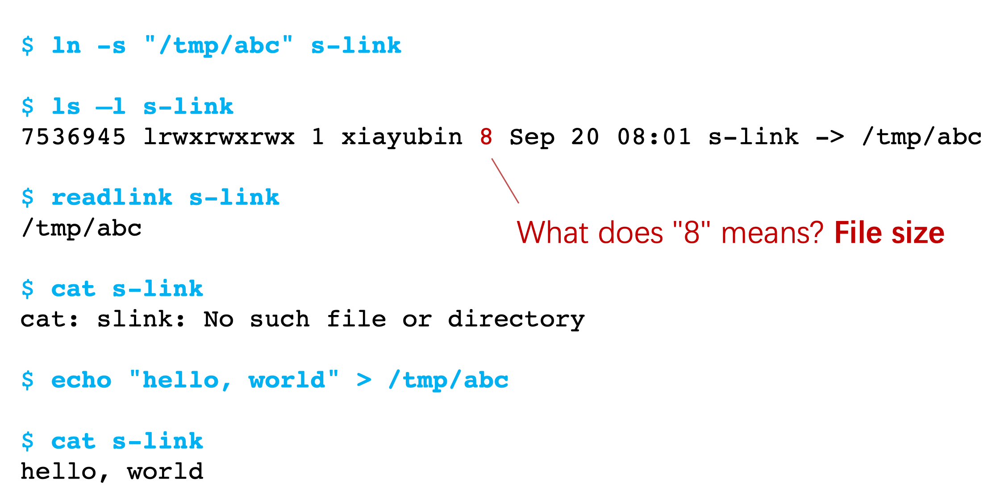

### Timeline

File open & read timeline
`open("/foo/bar", O_RDONLY)`

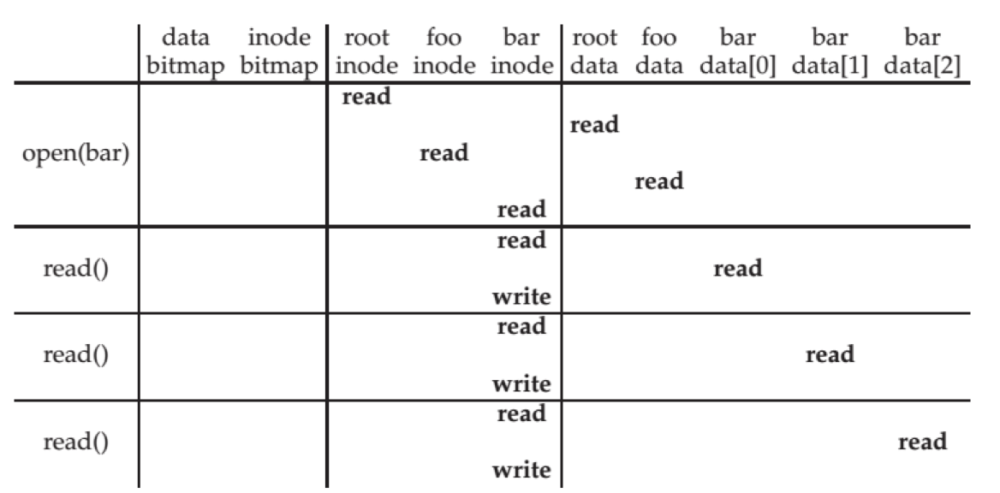

File creation time
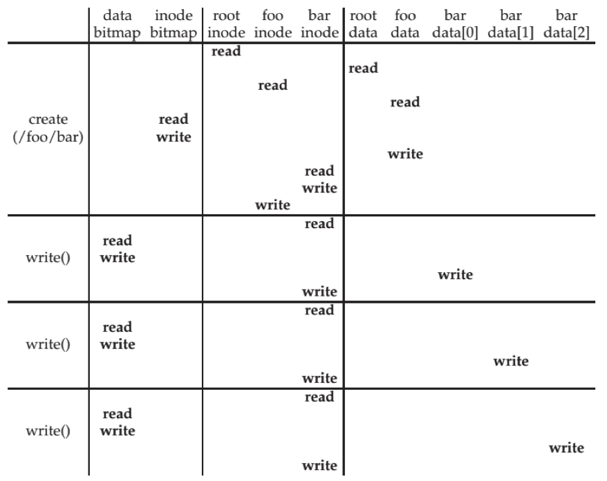

### File Allocation Table

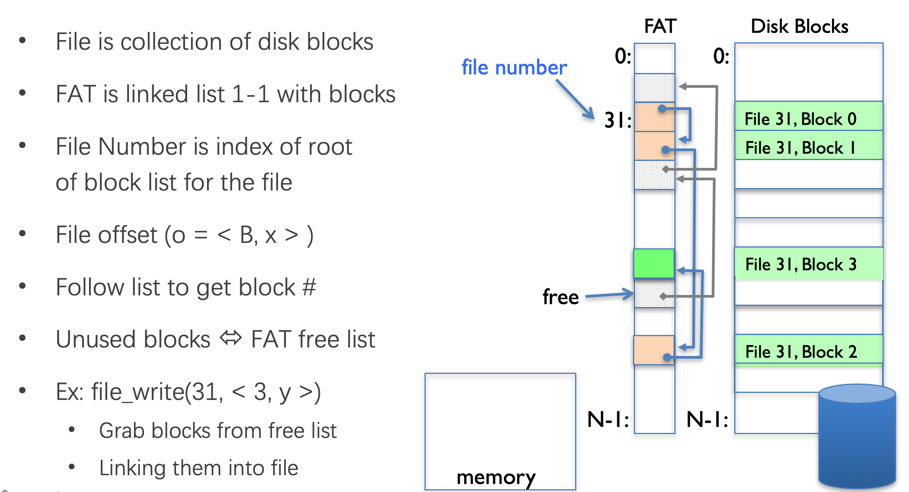

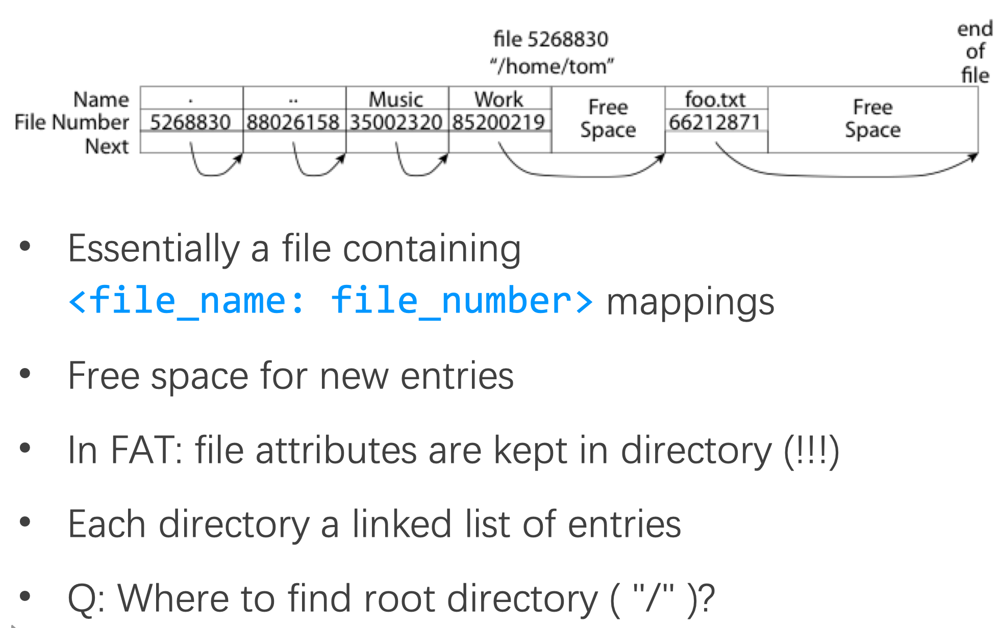

## File System Crash Consistency

Problem: Single file-system operation updates multiple on-disk data structures. 

Tension between file system performance and crash recovery. 

Recover Approach

- Synchronous meta-data update + fsck
- Soft update
- Logging

Tradeoffs

- FS ensures it can recover its meta-data
  - Internal consistency
  - No dangling references
  - Inode and block free list contain only used(not using) items
  - Unique name in one directory, etc. 
- Weak semantic FS provided limited guarantees
  - Atomicity for creat, rename, delete
  - Often no durability for anything
  - Often no order guarantees

## SYNC Metadata Update + FSCK

1. Check superblock
2. Check free blocks
3. Check inode states
4. Check inode links
5. Check duplicates
6. Check bad blocks
7. Check directories

The problem of fsck: too slow!

The right order of synchronous writes

- File creation
  - Mark inode as allocated
  - Create directory entry
- File deletion
  - Erase directory entry
  - Erase inode addrs[], mark as free
  - Mark blocks free

App-visible sys call semantics

- Durable 
  - Yes. Use write-through cache, sync I/O, O_SYNC
- Atomic
  - Often. `Mkdir` is an exception
- Ordered?
  - Yes, if all writes are sync

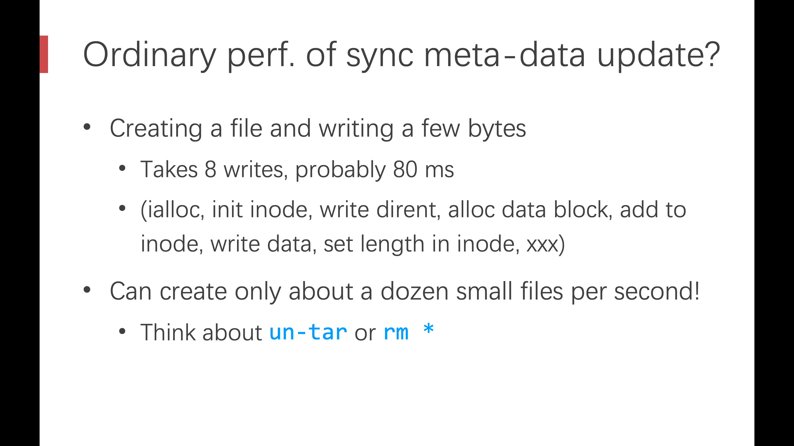

But we need to get better performance
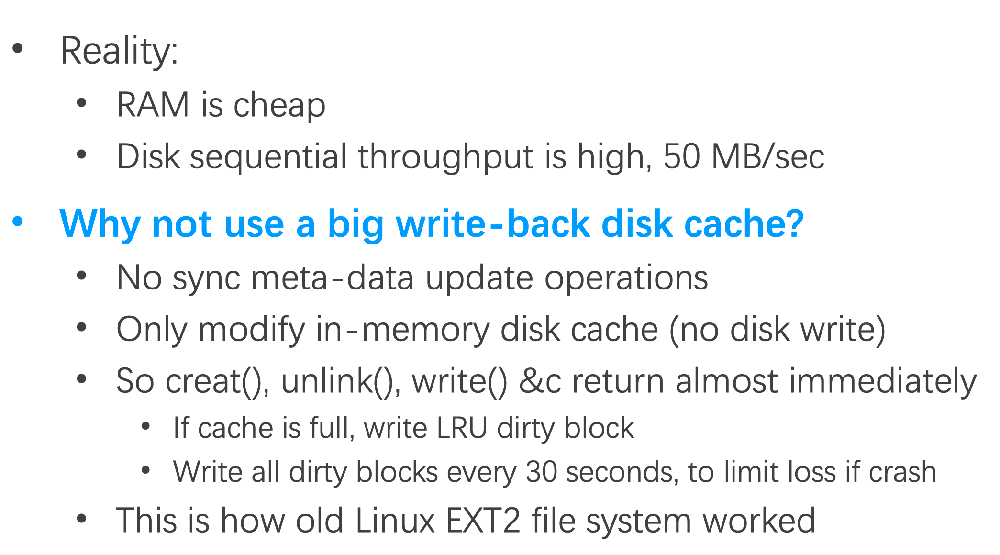

So we need to flush the disk
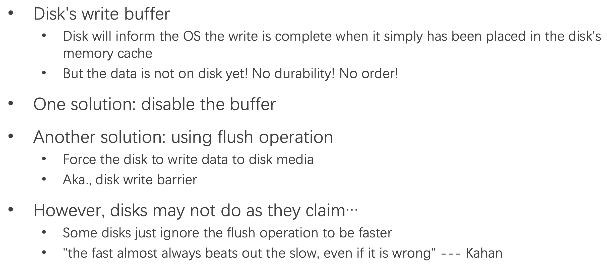

## Logging / Journaling

### Overview

Before update file system, **write note describing update**. 

Make sure note is safely on disk. 

Once note is safe, **update** file system

- If interrupted, read note and redo updates

Mainly reference paper [Optimistic Crash Consistency](https://dl.acm.org/doi/pdf/10.1145/2517349.2522726?download=true)

## Reference

1. [CSP Lecture 04](https://ipads.se.sjtu.edu.cn/courses/csp/slides/CSP_04_File_System.pptx)

