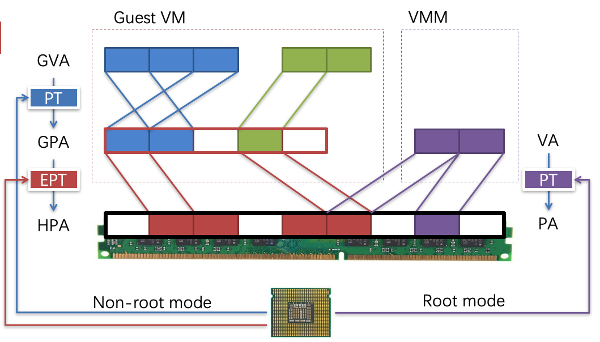
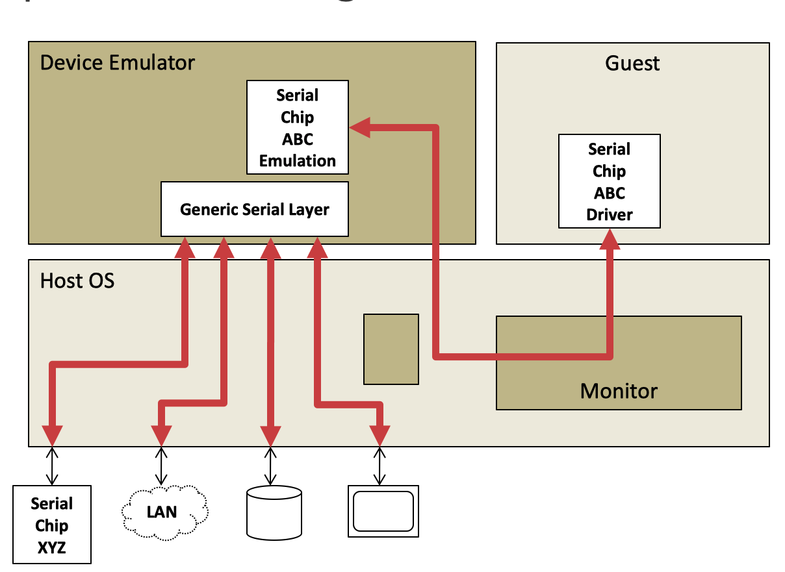

# 6. Virtualization

## Introduction to virtualization

### Virtualization layers

Machine from the perspective of a system

- ISA provides interface between system and machine
  
- Design space (level vs. ISA)
  
- As for system VMs and same ISA -> there are two kinds of virtual machines
  - Classic system VMs
    - Run directly on hardware
    - High performance
    - Eg: Xen, VMWare ESX Server
    - A.K.A Type 1
      
  - Hosted VMs
    - Ease of construction/installation
    - Eg: VMware Workstation
    - A.K.A Type 2
      

### Virtual Machine Monitor

1. The usage

   - For managing VMs which running guest OS

   - VMM runs underlying VMs (higher privilege)

     

2. Virtualize hardware

   - CPU
   - Memory
   - Device

3. And there are several different architectures of VMM
   

4. Principles in 1974

   - Efficiency
     - Innocuous instructions should execute directly on hardware
   - Resource control
     - Executed programs may not affect the system resources
   - Equivalence
     - The behavior of a program executing under the VMM should be the same as if the program were executed directly on the hardware (except possibly timing and resource availability)

   

   ​							*“an efficient, isolated duplicate of the real machine”*

## CPU Virtualization

1. OS VS. VMM
   - Similarities
     - Multiplex hardware
     - Higher privilege
   - Differences
     - Different abstraction
     - VMM schedules VMs, OS schedule processes
2. How does OS use the CPU?
   - Each process thinks it has the entire CPU
     - Does not care other  processes
   - OS schedules the processes
     - OS splits the CPU time to time-slices
     - Schedule each process preemptively
     - Save context, find next, restore context

### Can run it as an application? (OS on OS)

However, stuck at the privileged instructions and cannot run in user mode. 

Solution: Trap & Emulate

1. Trap: running privilege instructions will trap to the VMM
2. Emulate: those instructions are implemented as functions in the VMM
3. System states are kept in VMM’s memory, and are changed according
   

Now we can run os as an application

- Host OS virtualizes system states
  - Save guest system states in memory
- OS can deliver interrupt to a guest OS
  - Similar as delivering a signal to an application

But not all architectures are **strictly virtualizable**
An ISA is strictly virtualizable if when executed in a lesser privileged mode

- All instructions that access privileged state trap
- All instructions either trap or execute identically

But **X86 is not strictly virtualizable** (17 tricky instructions)

#### Deal with the 17 tricky instructions

1. Instruction interpretation: emulate them by software

   - Emulate all the system status using memory
   - None guest instruction executes directly on hardware
   - Negatives: very slow (not meet the performance expectation!)

2. Binary translation: translate them to other instructions

   - Translation before execution
   - Translation unit is basic block
   - Each basic block -> code cache
   - Translate the 17 instructions to function calls
     - Implemented by the VMM
   - Issues with binary translation
     - PC synchronization on interrupts
       - Now interrupt will only happen at basic block boundary\
       - But on real machine, interrupt may happen at any instruction
     - Carefully handle self-modifying code
       - Notified on writes to translated guest code
   - Architecture

   

3. Para-virtualization: replace them in the source code

   - Modify OS and let it cooperate with the VMM
     - Change sensitive instructions to calls to the VMM
       - Also known as **hypercall**
     - Hypercall can be seen as trap
   - Eg: Xen

4. New hardware: change the CPU to fix the behavior

   - VMX **root** operation
     - Fully privileged, intended for virtual machine monitor
   - VMX **non-root** operation
     - Not fully privileged, intended for guest software

   

## Memory Virtualization

How to virtualize the page tables?
Terminology: 3 types of address now
GVA (Guest virtual) -> GPA (Guest physical) -> HPA (Host physical)

### Shadow paging

Shadow page table maintain mapping from GVA to HPA

Two page tables now become **one**

1. VMM intercepts guest OS setting the virtual CR3
2. VMM iterates over the guest page table, constructs a corresponding shadow page table
3. In shadow PT, every guest physical address is translated into host physical address
4. Finally, VMM loads the physical address of the shadow page table

The number of shadow page tables

- Shadow page tables are per application
- Guest page tables are per application
- Host page tables are per VM

VMM needs to intercept when guest OS modifies page table, and updates the shadow page table accordingly

- Mark the guest table pages as read-only (in the shadow page table)
- If guest OS tries to modify its page tables, it triggers page fault
- VMM handles the page fault by updating shadow page table

Split a shadow page table to two tables

- One for user and one for kernel
- When guest OS switches to user mode, VMM will switch the shadow page table as well
- Recall trap & emulate

### Direct paging

1. Positive

   - Easy to implement and more clear architecture
   - Better performance: guest can batch to reduce trap

   Negatives

   - Not transparent to the guest  OS
   - The guest now knows much info like HPA
     - May use such info to trigger **rowhammer** attacks

2. Para-Virtualization

### New hardware

1. Hardware implementation

   - Intel’s EPT (Extended Page Table)
   - AMD’s NPT (Nested Page Table)

2. Another table

   - EPT for translation from GPA to HPGA
   - EPT is controlled by the hypervisor
   - EPT is per-VM

   

3. Issue: EPT increases Memory Access

   - One memory access from the guest VM may lead up to 20 memory accesses

## I/O Virtualization

1. Goal: Multiplexing device to guest VMs
   Challenges
   - Each guest OS has its own driver
   - How can one device be controlled by multiple drivers
   - What if one guest OS tries to format its disk?

### Direct access

VM owns a device exclusively

IOMMU: Page Tables for Devices

VT-d architecture defines a multi-level page-table structure for DMA address translation. 

Positives

- Fast, since the VM uses device just as native machine
- Simplify monitor: limited device drivers needed

Negatives

- Hardware interface visible to guest (bad for migration)
- Interposition is hard by definition (no way to trap and emulate)
- Now you need much more devices (imagine 100 VMs)

### Device emulation

VMM emulates device in software

For example

- VMware emulates a 8139 network card for VMs
- Since 8139 is widely used, almost every OS hat its driver

Pros

- Platform stability (good for migration)
- Allows interposition
- No special hardware support  is needed

Cons

- Can be very very slow! (Since it’s software emulated)

### Para-virtualized

Split the drivers to guest and host

VMM offers new type of device

- The guest OS will run a new driver (front-end driver)
- The VMM will run a back-end driver for each front-end
- The VMM will finally run device driver to drive the device

### Hardware assisted

Self-virtualization device

VMM

- An SR-IOV-capable device can configured to appear in the PCI configuration space as multiple functions

VM

- The VMM assigns one or more VFs to a VM by mapping the actual configurations space of the VFs to the configuration space presented to the virtual machine by the VMM

## Virtualization Technologies

The evolution of intel virtualization technology

Software-emulation, Para-Virtualization, Hardware assisted?

## Container Virtualization

### Review: Hardware Virtualization

How did we create a virtual machine (VM)

- Start with a **physical machine**
- Create software (**hypervisor**) responsible for isolating the guest OS inside the VM
- VM resources (**memory, disk, network, etc.**) are provided by the physical machine but visibility outside of the VM is **limited**. 

What’s the relationship between virtual machine and physic machine?

- VM and physical machine **share same instruction set**, so must the host and guest
- Guest OS can provide **a different application binary interface (ABI)** inside the VM
- Lots of challenges in getting this to work because guest OS expects to have **privileged hardware access**. 

### Operating System Virtualization

How to do create a virtual operating system (container)?

- Start with **a real operating system**
- Create software responsible for **isolating guest software** inside the container
- Container resources (processes, files, network sockets, etc.) are provided by the real operating system but **visibility** outside the container is **limited**. 

What are the implications?

- Container and real OS **share same kernel**
- So applications inside and outside the kernel must **share the same ABI**
- Challenges is getting this to work are due to **share OS namespaces**

### Why virtualize an OS?

Share many (but not all) of the benefits of hardware virtualization with **much lower overhead**. 

Decoupling

1. **Cannot** run multiple operating systems on the same machine.
2. Can transfer software setups to another machine as long as it has an **identical or nearly identical kernel**. 
3. Can **adjust container resources** to system needs

Isolation

1. Container should not leak information inside and outside the container
2. Can isolate all of the configuration and software packages a particular application needs to run

## OS VS. Hardware Overhead

Hardware virtualization system call path

- Application inside in the VM makes a system call
- Trap to the host OS (hypervisor)
- Hand trap back to the guest OS

OS virtualization System call path

- Application inside the container makes a system call
- Trap to the OS

### OS Virtualization is About Names

What kind of names must the container virtualize?

- Process IDs
- File names
- User names
- Host name and IP address

OS Virtualization is about Control

- CPU time
- memory
- Disk or network bandwidth

### The tech behind container

1. Not a new idea: `chroot` -> run command or interactive shell with special root directory
2. Linux namespaces
   - Mount points
     - allow different namespaces to see different views of the file system
   - Process IDs
     - New processes are allocated IDs in their current namespace and all parent namespaces
   - Network
     - Namespace can have private IP address and their own routing table, and can communicate with other namespaces through virtual interfaces
   - Devices
     - Devices can be present or hidden in different namespaces. 
3. Cgroups
   - A linux kernel feature that limits, accounts for, and isolates the resource usage of a collection of processes
     - Processes and their children remain in the same `cgroup`
     - `cgroups` makes it possible to control the resources allocated to a set of processes

4. UnionFS: A stackable unification file system
5. COW File System
   - Copy on write
   - Only make modifications to the underlying file system when the container modifies files
   - Speeds start up and reduces storage usage
     - The container mainly needs read-only access to host-files

### What is Docker?

Docker builds on previous technologies

- Provides a unified set of tools for container management on a variety of systems
- Layered file system images for easy updates
- Now involved in development of containerization libraries on Linux

## Reference

1. [CSP Lecture6 Slides](https://ipads.se.sjtu.edu.cn/courses/csp/slides/CSP_06_Virtualization.pptx)
2. [Prof. Geoffrey Challen’s notes](https://www.ops-class.org/slides/2017-04-28-containers/)