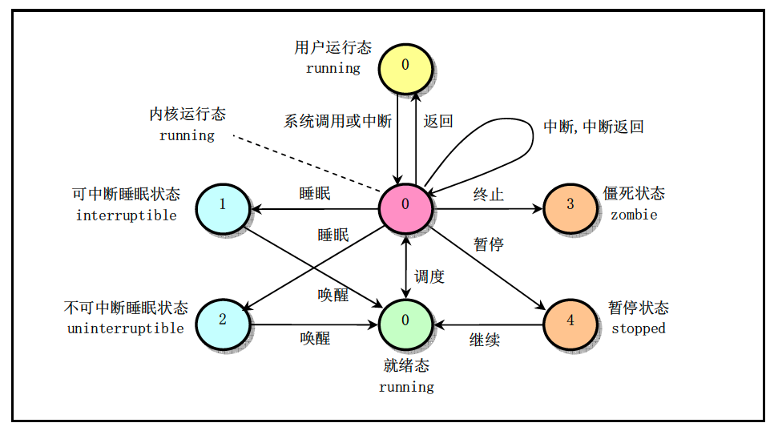

# Linux 0.11

## Overview

Learn the design and implementation of `Linux 0.11`

- The source code has been modified to be able to compiled by `> gcc-4.9`
- I have made a docker image which has essential package installed
  - Simply `docker pull vic0428/linux0.11`

## Startup

1. First get the source code

   ```bash
   wget https://git.lug.ustc.edu.cn/gloomy/ustc_os/raw/master/Linux-0.11-lab1.tar.gz
   ```

2. Pull the container

   ```
   docker pull vic0428/linux0.11
   ```

3. Run the container

   ```c++
   docker run -it --rm -v ${Linux-0.11}:/Linux-0.11 vic0428/linux0.11
   ```

   - In container, we can

     - `make` compile the image

     - `make debug` start gdb

       - We need to have a `.gdbinit`  in `Linux-0.11` source code directory

         ```bash
         set architecture i386:x86-64
         file tools/system
         target remote ${192.168.xxx.xxx}:1234
         ```

   - Outside container

     - `make start` => start the `qemu`

## Booting

1. Build a small `bootsect.s` (end with a infinite loop)

   ```assembly
   entry _start
   _start:
   ! Read cursor posiiton
       mov ah,#0x03
       xor bh,bh
       int 0x10
   
   ! Print the string in the screen
       mov cx,#24
       mov bx,#0x0007
       mov bp,#msg1
   ! es:bp : the address of string
       mov ax,#0x07c0
       mov es,ax
       mov ax,#0x1301
       int 0x10
   
   inf_loop:
       jmp inf_loop
   
   msg1:
   		.byte 13,10
   		.ascii "Loading system ..."
   		.byte 13,10,13,10
       
   .org 510
   boot_flag:
   		.word 0xAA55
   ```

   Next build the image (skip the first 32 bytes header)

   ```bash
   as86 -0 -a -o bootsect.o bootsect.s
   ld86 -0 -s -o bootsect bootsect.o
   dd bs=1 if=bootsect of=Image skip=32
   ```

   Now we can run `qemu` with this image

## System call

If we want to add a new system call

- Add definition in `include/linux/sys.h`

  ```c++
  extern int sys_iam();
  fn_ptr sys_call_table[] = {.., ..., ..., sys_iam}
  ```

- Add system call number  in `include/unistd.h`

  ```
  #define __NR_iam	72
  ```

- Add total number of system calls `kernel/system_call.s`

  ```
  nr_system_calls = 73
  ```

- Implement `iam` system call in `kern/iam.c`

- Change `kernel/Makefile`

  - Use `get_fs_byte` and `put_fs_byte` to exchange data between kernel space and user space

## Process state control

Possible process state


## Implement semaphore

We need to add new system call `sem_open`, `sem_post`, `sem_wait`, `sem_unlink`

```c
#define __LIBRARY__
#include <unistd.h>
#include <linux/sched.h>
#include <linux/kernel.h>
#include <asm/segment.h>
#include <asm/system.h>

#define SEM_COUNT 32

sem_t semaphores[SEM_COUNT];

#define QUE_LEN 16
#define SEM_FAILED  (void*) 0
struct semaphore_queue
{
	int front;
	int rear;
	struct task_struct *wait_tasks[QUE_LEN];
};
typedef struct semaphore_queue sem_queue;

struct semaphore_t
{
    int value;
    int occupied;
    char name[16];
    struct semaphore_queue wait_queue;
};
typedef struct semaphore_t sem_t;

// Init queue
void init_queue(sem_queue *q)  {
    q->front = q->rear = 0;
}

// Check the queue is empty
int is_empty(sem_queue *q) {
    return q->front == q->rear? 1: 0;
}

// Check the queue is full
int is_full(sem_queue *q) {
    return (q->rear + 1) % QUE_LEN == q->front? 1: 0;
}

/* Get first task of task queue */
struct task_struct* get_task(sem_queue *q) {
    if (is_empty(q)) {
        printk("Task queue is empty\n");
        return NULL;
    }
    struct task_struct* tmp = q->wait_tasks[q->front];
    q->front = (q->front + 1) % QUE_LEN;
    return tmp;
}

/* Insert task into the end of task queue */
void insert_task(sem_queue *q, struct task_struct *task) {
    if (is_full(q)) {
        printk("Task queue is full\n");
        return;
    }
    q->wait_tasks[q->rear] = task;
    q->rear = (q->rear + 1) % QUE_LEN;
}

/* Get sem location */
int sem_location(const char *name) {
    for (int i = 0; i < SEM_COUNT; i++) {
        if (strcmp(name, semaphores[i].name) == 0 && semaphores[i].occupied == 1) {
            return i;
        }
    }
    return -1;
}

sem_t *sys_sem_open(const char *name, unsigned int value) {
    char tmp[16];
    // Copy to tmp buffer
    for (int i = 0; i < 16; i++) {
        tmp[i] = get_fs_byte(name + i);
        if (get_fs_byte(name + i) == '\0') {
            break;
        }
    }
    int i;
    if ((i = sem_location(tmp)) != -1) {
        return semaphores + i;
    }
    for (int i = 0; i < SEM_COUNT; i++) {
        if (semaphores[i].occupied == 0) {
            strcpy(semaphores[i].name, tmp);
            semaphores[i].occupied = 1;
            semaphores[i].value = value;
            init_queue(&semaphores[i].wait_queue);
            return semaphores + i;
        }
    }
    return NULL;
}

int sys_sem_wait(sem_t *sem) {
    cli();
    sem->value--;
    if (sem->value < 0) {
        current->state = TASK_UNINTERRUPTIBLE;
        insert_task(&(sem->wait_queue), current);
        schedule();
    }
    sti();
    return 0;
}
int sys_sem_post(sem_t *sem) {
    cli();
    sem->value++;
    struct task_struct *p;
    if (sem->value <= 0) {
        p = get_task(&(sem->wait_queue));
        if (p != NULL) {
            p->state = TASK_RUNNING;
        }
    }
    sti();
    return 0;
}

int sys_sem_unlink(const char *name) {
    char tmp[16];
    // Copy to tmp buffer
    for (int i = 0; i < 16; i++) {
        tmp[i] = get_fs_byte(name + i);
        if (get_fs_byte(name + i) == '\0') {
            break;
        }
    }
    int ret = sem_location(tmp);
    if (ret != -1) {
        semaphores[ret].value = 0;
        semaphores[ret].occupied = 0;
        strcpy(semaphores[ret].name, "\0");
        return 0;
    }
    return -1;
}
```


## Reference

1. [UTSC OS](http://staff.ustc.edu.cn/~ykli/os2020/)

2. [HIT OS](https://hoverwinter.gitbooks.io/hit-oslab-manual/content/sy2_syscall.html)

